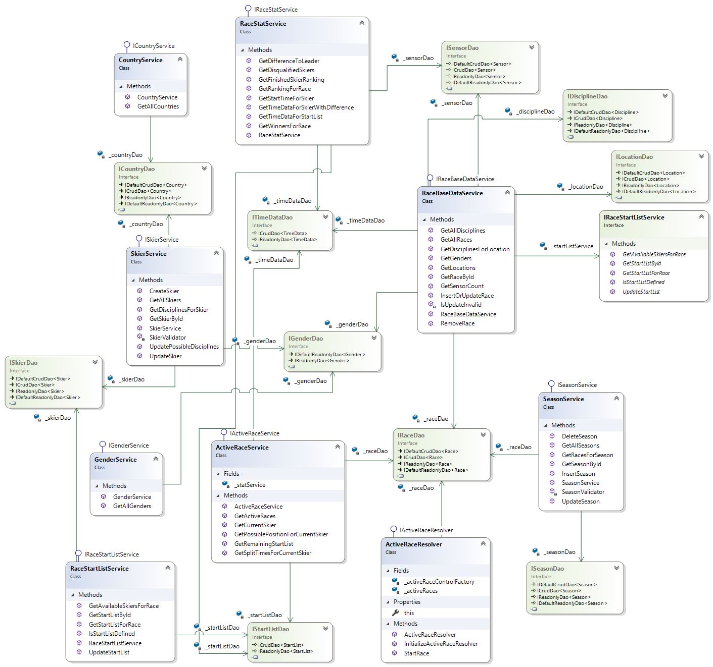
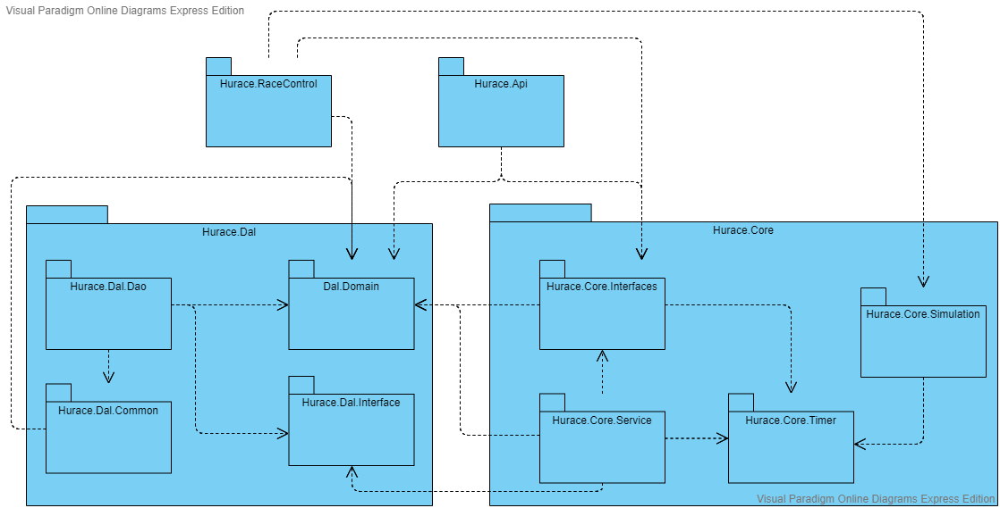
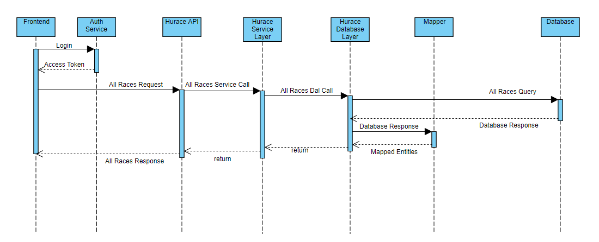
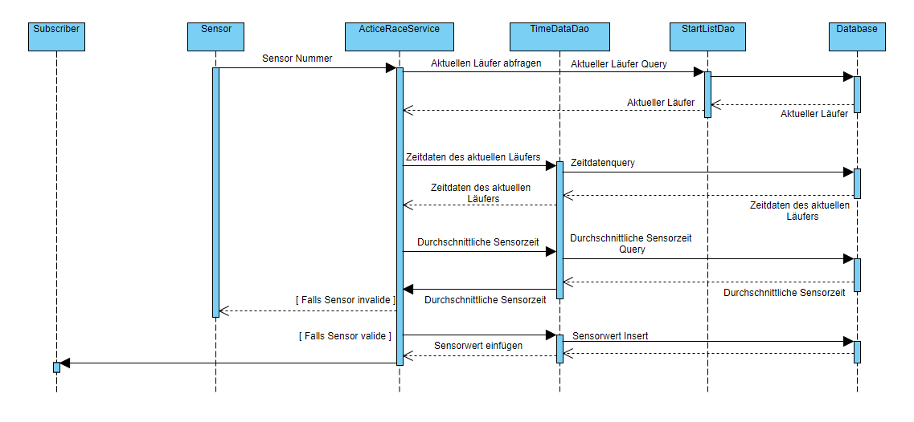

# Hurace

## Setup

Um Hurace in Betrieb zu nehmen muss der zur Verfügung gestellte Docker Container gestartet werden.
Im Verzeichnis `./db` befindet sich ein Docker-Compose Script, welches automatisch eine Produktivdatenbank sowie eine Testdatenbank mit den notwendigen Tabellen und Daten erstellt. Dieses ist lediglich mit `docker-compose up --build` auszuführen.
Gegebenfalls muss die End-Of-Line Sequence der Dateien `entrypoint.sh` und `init.sh` auf `LF` geändert werden
Falls der Docker Container nicht lokal (localhost) läuft müssen die Connection Strings in den `appsettings.json` der API sowie der RaceControl angepasst werden.

## Datenbank

Die Datenbank von Hurace besteht aus folgenden 18 Tabellen. In nachfolgendem Diagramm ist zu sehen, welche Spalten jeweils definiert sind und wie die Tabellen zusammenhängen.

Bei der Datenbank handelt es sich um eine SQL Server Datenbank.

### Tabellen

#### Country

Stellt ein Land dar.

#### Discipline

Stellt eine Disziplin dar.

#### EventType

Stellt den Typ eines möglichen Events dar, welches während eines Rennens passieren kann. Solche Events werden in [RaceData](#racedata) gespeichert. Diese Tabelle dient lediglich zur Validierung der einfügbaren Events.

#### Gender

Stellt das Geschlecht dar.
Dies ist in einer eigenen Tabelle ausgelagert, um das Geschlecht eines Rennens und das eines Schirennläufers eindeutig zu definieren.

#### Location

Stellt einen Renn-Ort dar und besitzt zudem eine Referenz auf einen [Country](#country) Eintrag in dem sich der Ort befindet.

#### PossibleDiscipline

Dies ist eine Assoziativtabelle zwischen [Discipline](#discipline) und [Location](#location). Hier wird abgebildet, welche Disziplinen an welchen Orten möglich sind.

#### Race

Stellt ein Rennen dar. Zusätzlich zu den informellen Spalten wird zudem eine Referenz auf ein [RaceState](#racestate) gespeichert, welcher den aktuellen Zustand des Rennens angibt.

#### RaceData

Diese Tabelle stellt ein Event-Log für ein Rennen dar. Hier werden alle Ereignisse eines Rennens gespeichert. Mittels eines [EventTypes](#eventtype) wird bestimmt um welches Event es sich handelt. Diese Tabelle bildet eine Vererbungshierarchie ab, wobei die Tabellen [RaceEvent](#raceevent) und [SkierEvent](#skierevent) spezifischere Infos enthalten und eine Referenz auf diese Tabelle besitzen.

#### RaceEvent

Dies ist eine spezifizierte Ausführung von [RaceData](#racedata), welche ein Rennevent (z.B. Rennstart, Abbruch) darstellt.

#### RaceState

Stellt den Zustand eines Rennens dar. Dieser könnte z.B. Gestartet, Abgeschlossen oder Abgebrochen sein.

#### Season

Stellt eine Rennsaison dar. Jedes Rennen muss eine Referenz auf ein Rennen besitzen.

#### Sensor

Stellt einen Sensor dar, dieser hat eine Referenz auf ein [Race](#race). Dies folgt daraus, das sich die Anzahl der Sensoren von Rennen zu Rennen ändern können auch wenn diese am selben [Location](#location) stattfinden.

#### Skier

Stellt einen Rennläufer dar. Dieser hat eine Referenz auf sein Herkunftsland [Country](#country), sowie auf ein Geschlecht [Gender](#gender).

#### SkierDiscipline

Stellt dar, an welchen Disziplinen ein Schirennläufer teilnehmen kann.

#### SkierEvent

Dies ist eine spezifizierte Ausführung von RaceData, welche ein Event eines Skirennläufers darstellt.
Dabei kann es sich z.B. um eine Disqualifikation oder um eine Zwischenzeit handeln.

#### StartList

Hier wird die Startreihenfolge eines Rennens dargestellt. Diese Tabelle referenziert einen Skirennläufer sowie ein Rennen.
Um doppelte Einträge zu vermeiden, kann ein Schirennläufer nur einmal für ein Rennen eingetragen werden.
Zudem wird der aktuelle Startzustand [StartState](#startstate) gespeichert, dieser kann z.B. Ausfall, Fertig oder im Starthaus wartend sein.

#### StartState

Stellt den Zustand eines StartListen-Eintrags dar. Dieser kann z.B. Fertig, Wartend oder Ausgefallen sein.

#### TimeData

Stellt eine Zwischenzeit dar. Es wird eine Referenz auf ein [SkierEvent](#skierevent) gespeichert um speichern zu können, wann eine Zwischenzeit passiert ist.
Zudem wird der [Sensor](#sensor) referenziert, welcher die Zwischenzeit aufgenommen hat.
Dabei kann ein Skirennläufer nur eine Zwischenzeit pro Rennen für einen Sensor besitzen.
Weiters wird nicht ein Rennläufer direkt sondern eine [StartList](#startlist) referenziert um sicherzugehen, dass der Schiläufer antritt bei dem jeweiligen Rennen.

### Testdaten

Die Testdaten werden zum Großteil generiert.
Basis dafür bilden vier JSON-Files für Rennorte, Länder, Disziplinen und Rennläufer.
Zudem wird eine Saison angelegt, welche vom 28.10.2019 bis zum 17.03.2020 dauert.
Für die Länder werden die bekanntesten Schination eingefügt.
Die Rennorte sind ebenfalls bekannte Orte, an welchen Rennen in der Vergangenheit stattgefunden haben.

Für jeden Schirennläufer wird ein Geburtsdatum generiert. Weiters werden die möglichen Disziplinen der Schirennläufer erstellt.
Schirennen werden zufällig in der Saison verteilt, dabei wird geachtet, dass nicht zwei Rennen am selben Tag stattfinden.
Für die Testdaten werden nur Schirennen nur für Männer erstellt um die Datengenerierung zu vereinfachen.
Anschließend werden Rennen generiert und für jedes Rennen fünf Sensoren angelegt.
Weiters wird bei jedem Rennen die Startliste befüllt.

Anschließend werden die Rennläufe generiert.
Dabei wird für jedes Rennen die Startliste durchlaufen. Der Startzeitpunkt jedes Rennens ist um 12 Uhr des Renntages. Die Zwischenzeiten werden zufällig erstellt. Zwischenzeiten sind durchschnittlich 20 Sekunden auseinander, wobei dieser Wert um bis zu einer Sekunde abweichen kann.

## Database Access Layer

Der Database Access Layer (DAL) stellt eine Schnittstelle zur Verfügung, die Daten in der Datenbank zu manipulieren, ohne direkt SQL-Queries absetzen zu müssen.
Der DAL teilt sich in zwei Bereiche auf:

-   Interfaces, welche die Methoden definieren, mit welchen die Daten manipuliert werden können
-   Database Access Objects, welche eine konkrete Implementierung der Interfaces für eine konkrete Datenbank zur Verfügung stellen.

Jedes DAO repräsentiert dabei eine Datenbanktabelle.

### Interfaces

Um verschiedene Datenbanksysteme realisieren zu können, werden die Methoden in Interfaces definiert, welche von den konkreten DAOs implementiert werden.
Da einige Methoden in mehreren DAOs ähnlich funktionieren und in allen DAOs verfügbar sein sollten, gibt es die vier Basis Interfaces von denen geerbt werden kann.
Jene Interfaces, welche nur von den Basis Interfaces erben und keine Methoden hinzufügen sind hier nicht näher beschrieben. Die gesamte Vererbungshierarchie sieht wie folgt aus:

<!-- TODO UPDATE -->

#### Basis Interfaces

##### IReadonlyDao

Dieses Interface definiert nur eine `FindAllAsync` Methode welche in allen DAOs verfügbar sein soll.

##### IDefaultReadonlyDao

Dieses Interface erbt von [IReadonlyDao](#ireadonlydao) und definiert eine `FindByIdAsync` Methode mit welcher ein Eintrag anhand der Id retourniert.

##### ICrudDao

Dieses Interface erbt von [IReadonlyDao](#ireadonlydao) und definiert die Basis Crud Methoden:

-   `UpdateAsync`
-   `InsertAsync`
-   `DeleteAllAsync`

Falls ein DAO eine Entität verwaltet die z.B. einen zusammengesetzten Primärschlüssel besitzt, kann von diesem Interface geerbt werden.

##### IDefaultCrudDao

Dieses Interface erbt sowohl von [IReadonlyDao](#ireadonlydao) als auch von [ICrudDao](#icruddao) und definiert CRUD Methoden für Entitäten mit einer einzelnen Id als Primärschlüssel:

-   InsertGetIdAsync
-   DeleteAsync

#### Konkrete Interfaces

##### ITimeDataDao

Dieses Interface erbt von [ICrudDao](#icruddao). Dadurch das [TimeData](#timedata) keinen eindeutigen Primärschlüssel besitzt sondern sich dieser aus der Id des [Skiers](#skier) und der Id des [Races](#race) zusammensetzt müssen `DeleteAsync` und `FindByIdAsync` eigen definiert werden.

Zudem werden folgende Methoden definiert:

-   `CountTimeDataForRace` - Zählt die Timedataeinträge für ein Rennen
-   `GetAverageTimeForSensor` - Liefert die Durchschnittszeit für einen Sensor
-   `GetRankingForSensor` - Liefert das Zeitranking für einen bestimmten Sensor
-   `GetStartTimeForStartList` - Liefert den Zeitpunkt wenn ein Rennfahrer gestartet ist
-   `GetTimeDataForStartList`- Liefert alle Zeitdaten eines Rennläufers

Zudem definiert dieses Interface eine Methode `GetRankingForRace` diese liefert den aktuellen Stand des Rennens.

##### IStartListDao

Dieses Interface erbt von [ICrudDao](#icruddao). Gleich wie bei [ITimeDataDao](#itimedatadao) müssen `DeleteAsync` und `FindByIdAsync` eigen definiert werden. Auch hier besteht der Primärschlüssel aus der Id des [Skiers](#skier) und der Id des [Races](#race).

Zudem werden folgende Methode definiert:

-   `CountStartListForRace` - Zählt die Startlisteneinträge eines Rennens
-   `DeleteAllForRace` - Löscht alle Startlisteneinträge für ein Rennen
-   `GetCurrentSkierForRace` - Liefert den laufenden Rennläufer für ein Rennen
-   `GetDisqualifiedSkierForRace` - Liefert alle disqualifizierten Skier eines Rennens
-   `GetNextSkierForRace` - Liefert den nächsten Skier für ein Rennen
-   `GetRemainingStartListForRace` - Liefert die noch nicht gefahrenen Skifahrer für ein Rennen
-   `GetStartListForRace` - Liefert die gesamte Startliste für ein Rennen

##### ILocationDao

Dieses Interface erbt von [IDefaultCrudDao](#idefaultcruddao). In diesem Interface wird auch die Tabelle [PossibleDiscipline](#possiblediscipline) mit verwaltet. Deshalb sind diese Methoden definiert:

-   `DeletePossibleDisciplineForLocation`
-   `GetPossibleDisciplineForLocation`
-   `InsertPossibleDisciplineForLocation`

##### ISkierDao

Dieses Interface erbt von [IDefaultCrudDao](#idefaultcruddao). In diesem Interface wird auch die Tabelle [SkierDiscipline](#skierdiscipline) mit verwaltet. Deshalb sind diese Methoden definiert:

-   `DeletePossibleDisciplineForSkier`
-   `DeleteAllPossibleDisciplineForSkier`
-   `GetPossibleDisciplinesForSkier`
-   `InsertPossibleDisciplineForSkier`
-   `FindAvailableSkiersForRace` - Liefert alle Rennfahrer welche an einem Rennen teilnehmen können und noch nicht in der Startliste sind

##### IRaceDao

Dieses Interface erbt von [IDefaultCrudDao](#idefaultcruddao).
Zudem werden folgende Methoden definiert:

-   `GetActiveRaceById` - Liefert ein laufendes Rennen anhand der Id
-   `GetActiveRaces` - Liefert alle aktiven Rennen.
-   `GetRacesForSeasonId` - Liefert alle Rennen aus einer Saison

##### ISensorDao

Dieses Interface erbt von [IDefaultCrudDao](#idefaultcruddao).
Zudem werden folgende Methoden definiert:

-   `DeleteAllSensorsForRace` - Löscht alle Sensoren für ein Rennen
-   `FindAllSensorsForRace` - Liefert alle Sensoren für ein Rennen
-   `GetLastSensorNumber` - Liefert die letzte Sensornummer, also den Zielsensor, für ein Rennen
-   `GetSensorForSensorNumber` - Liefert einen Sensor für ein Rennen anhand seiner Nummer

##### ISeasonDao

Dieses Interface erbt von [IDefaultCrudDao](#idefaultcruddao).
Zudem werden folgende Methoden definiert:

-   `CountRacesForSeason` - Liefert die Anzahl der Rennen in einer Saison

### Domain Objects

Domain Objects dienen dazu die Tabellen als Klassen abzubilden.
Bis auf die Tabellen [PossibleDiscipline](#possiblediscipline) und [SkierDiscipline](#skierdiscipline) gibt es für jede Tabelle ein eigenes Domain Object. Die Spaltennamen werden als Properties modelliert. Zudem werden 1:1 Verbindungen ebenfalls als Properties abgebildet.
In den Domain Objects kommen zwei Attribute zum Einsatz um das Mappen zu erleichtern.
Für Primärschlüssel wird das `KeyAttribute` von `System.ComponentModel.DataAnnotations` verwendet.
Weiters sind in jedem Domain Object die referenzierten Tabellen als Properties verfügbar (z.B. [Country](#country) bei [Skier](#skier)). Diese werden mit dem `NavigationalAttribut` gekennzeichnet.

### Database Access Objects

Die Database Access Objects (DAOs) sind eine konkrete Implementierung der [Interfaces](#interfaces).
Konkret stellen diese einen Zugriff auf eine SQL Server Datenbank zur Verfügung.
Gleich wie bei den [Interfaces](#interfaces) gibt es auch Basisklassen mit den gleichen Namen, die die jeweiligen Interfaces implementieren. Weiters gibt es eine `BaseDao` Basisklasse welche über Methoden zum Ansprechen der Datenbank verfügt. Diese Methoden verwenden ADO.NET um Die Daten aus der Datenbank zu laden. Wie die Daten in Domänenklassen gemappt werden, wird in [Mapper](#mapper) beschrieben. Weiters definiert `ReadonlyDao` eine überschreibbare Methode `DefaultSelectQuery` diese ermöglicht es Select Statements anzupassen ohne diese komplett neu implementieren zu müssen.
Im folgenden Diagram ist die Vererbungshierarchie der DAOs zu sehen.

Sämtliche Funktionalität ist dabei in `BaseDao` untergebracht. Zudem besitzt diese Klasse eine `ConnectionFactory` mit welcher eine Datenbankverbindung aufgebaut werden und anschließend SQL-Statements ausgeführt werden können.
Weiters steht eine [StatementFactory](#statementfactory) zur Verfügung, welche einfache SQL Statements erzeugen kann.
Die wichtigsten Methoden sind im Anschluss beschrieben.

#### QueryAsync

Diese Methode führt eine Query aus und liefert eine List an generischen Ergebnissen.
Dabei wird ein Statement und optional Query Parameter übernommen.Ein Query Parameter besteht dabei aus einem Key und einem Value. Der Key gibt an, wo der Value des Query Parameters im SQL Statement eingefügt werden soll. Dies dient dazu SQL-Injection zu verhindern.Zudem kann noch eine Konfiguration für den [Mapper](#mapper) übergeben werden. Zuerst wird mittels der `ConnectionFactory` ein `DbCommand` erzeugt. Anschließend wird das Statement ausgeführt und die Ergebnisse mittels des [Mappers](#mapper) gemappt und retourniert.

#### ExecuteAsync

Diese Methode führt ein Statement auf der Datenbank aus, dabei kann es sich z.B. um ein Update, Insert oder Delete Statement handeln. Diese Methode übernimmt ein Statement sowie die Query Parameter dafür. Anschließend wird wie bei [QueryAsync](#queryasync) ein `DbCommand` erzeugt, mit welchem das Statement ausgeführt wird.

#### ExecuteGetIdAsync

Diese Methode funktioniert ähnlich wie [ExecuteAsync](#executeasync). Der Unterschied ist der, dass bei dieser Methode die letzte generierte Id returniert wird.

#### ExecuteScalarAsnyc

Diese Methode liefert einen einen Wert einer skalaren Operation, z.B. `count`.

#### Mapper

Um nicht manuell einen Mapper für jedes DTO schreiben zu müssen, wird diese Funktionalität in einen Mapper ausgelagert. Dieser hat eine generische Methode `MapTo`. Der Mapper durchläuft alle Properties des angegebenen generischen Typen und holt sich mittels des Property Names einen Wert aus dem ebenfalls übergebenen `IDataRecord`. `IDataRecord` enthält alle Daten welche aus der ausgeführten Query zurückkommen. Ist ein Property mit dem `NavigationAttribute` gekennzeichnet, so wird `MapTo` rekursiv aufgerufen und die Properties dieses Typen gemappt.
Mittels einer [MapperConfig](#mapperconfig) kann konfiguriert werden, dass z.B ein Property einen Wert erhält welcher unter einem anderen Namen aus der Datenbank geholt wird. Beispielsweise wird für einen [Skier](#skier) der [Country](#country) mitgeladen. Damit die beiden Id Spalten nicht kollidieren, wird die Id des [Countries](#country) als `countryId` geladen, in der [MapperConfig](#mapperconfig) kann konfiguriert werden, dass die Werte trotzdem richtig zugeordnet werden. Weiters wird mit der [MapperConfig](#mapperconfig) angegeben, welche referenzierten Entitäten geladen werden sollen.

##### MapperConfig

Eine MapperConfig bietet vier Methoden, zwei zum Konfigurieren und zwei zum Auslesen.
Mittels `AddMapping` können für einen generischen Mappings definiert werden. Dabei wird eine Liste von Tuplen übernommen mit jeweils dem Namen der Spalte und der Name des Properties auf welchen gemappt werden soll.
Zudem gibt es eine Methode `Include` diese nimmt einen generischen Typen. Mit dieser Methode wird bestimmt, dass eine Property mit dem `NavigationalAttribute` ebenfalls gemappt werden soll. Diese Methode wird bei `AddMapping` automatisch aufgerufen.

Mit `IsIncluded` kann herausgefunden werden ob ein Property mit dem `NavigationalAttribute` inkludiert werden soll und mit `MappingExists` wird geprüft ob für einen Typen und dessen Property ein Mapping existiert.

#### StatementFactory

Um simple Select Statements nicht jedes mal neu schreiben zu müssen, wird eine `StatementFactory` zur Verfügung gestellt. Diese ermöglicht es Select, Insert und Update Queries anhand eines generischen Typen zu generieren. Einer der drei Builder kann mittels der jeweiligen Methoden erzeugt werden, der generische Typ gibt dabei an, auf welche Tabelle das Statement ausgeführt wird.
Die Vererbungshierarchie sieht wie folgt aus:

Einige Methoden sind für mehreren StatementBuilder verfügbar:

##### Where

Die Where Methode ist sowohl für den [UpdateStatementBuilder](#updatestatementbuilder) als auch für den [SelectStatementBuilder](#selectstatementbuilder) verfügbar. Diese Methode nimmt einen generischen Typen sowie eine Liste von Query Parametern. Der Name des generischen Typen wird als Name der Tabelle herangezogen auf welcher die Where Condition zutrifft.

Die drei StatementFactories bieten zudem folgende Methoden

##### SelectStatementBuilder

###### Join

Mit der Join Methode können Tabellen gejoined werden.
Die Methode nimmt zwei generische Typen und eine Liste von Join Parametern. Diese bestehen aus zwei Strings, welche die Spaltennamen angeben, welche beim Join verglichen werden sollen. Der Name des ersten generischen Typs steht für die Tabelle von welcher aus gejoined wird und der Name des zweiten Typs für die Tabelle auf welche gejoined wird. Diese Daten werden zwischengespeichert und später beim Aufruf von [Build](#build) wieder abgerufen.

###### Build - Select

Die Build Methode baut aus den konfigurierten Einstellungen ein SQL Statement mit Query Parametern sowie einer MapperConfig zusammen. Zuerst werden die Properties des generischen Typen durchlaufen und dabei werden die Namen der Properties als Spaltennamen in das Select Statement eingefügt, der Name des generischen Typen wird als Tabellenname herangezogen. Dies wird auch für die Spalten der gejointen Tabellen gemacht.
Anschließend werden die Join Constraints eingefügt. Zuletzt werden die Where Conditions aus [Where](#where) eingefügt.

##### UpdateStatementBuilder

###### WhereId

Diese Methode erlaubt es automatisch die Primärschlüssel einer Entität als Where Conditions festzulegen. Dies geschieht mithilfe des `KeyAttributes`.

###### Build - Update

Diese Methode baut wiederum ein Statement aus der Konfiguration zusammen. Dabei werden die Namen der Properties des generischen Datentypes als Spalten eingefügt. Navigation Properties werden dabei ignoriert. Aus der Wertebelegung der Properties werden zudem die Query Parameter generiert.
Zuletzt werden noch die Where Conditions eingefügt.

##### InsertQueryBuilder

###### Build - Insert

Diese Methode funktioniert ähnlich zu [Build - Update](#build---update), außer, dass die hier keine Where Conditions eingefügt werden.

## Businesslogik

Die Businesslogik von Hurace wird in folgende Services aufgeteilt, diese greifen auf die Database Access Layer zu und werden von den ViewModels sowie der API genutzt. Die Abhängigkeiten werden dabei mit Dependency Injection an die Klasse übergeben. Dies führt zu einer loosen Kopplung der Komponenten und somit zu leichterer Austauschbarkeit der Komponenten.

Die Abhängigkeitshirachie ist in folgendem Diagram zu sehen

Methoden welche nur Wrapper um die jeweiligen Methoden der DAL sind werden zwar angeführt aber nicht näher beschrieben.

### ActiveRaceResolver

Dieser Service ist dafür da, aktive Rennen zu verwalten. Er wird im Dependency Provider als Singleton angelegt da dieser alle aktiven Rennen verwalten.

#### InitializeActiveRaceHandler

Diese Methode initialisiert den `ActiveRaceResolver`. Dabei werden alle aktiven Rennen aus der Datenbank geladen. Für jedes Rennen wird ein `ActiveRaceControlService` erstellt und zum Abfragen gespeichert. Zudem wird auf `OnRaceFinished` `OnRaceFinished` ein Delegate registriert, damit diese automatisch wieder entfernt werden.

#### StartRace

Diese Methode startet ein Rennen, dafür wird ein `ActiceRaceControlService` erzeugt und retourniert. Der erzeugte Service wird gespeichert, damit es für ein aktives Rennen immer nur einen Service gibt. Zudem wird auf `OnRaceFinished` `OnRaceFinished` ein Delegate registriert, damit diese automatisch wieder entfernt werden.

#### Indexer

Mittels des Indexers kann ein `ActiveRaceControlService` eines bereits laufenden Rennens geladen werden.

### ActiveRaceControlService

In diesem Service werden zum einen Events definiert, welche über Ereignisse informieren und zum anderen werden Methoden definiert, welche für den Rennablauf benötigt werden.

#### Events

Folgende Events werden vom ActiceRaceControlService zur Verfügung gestellt:

-   `OnSkierStarted` - Wird ausgelöst sobald die Rennstrecke freigegeben wurde.
-   `OnSkierFinished` - Wird ausgelöst sobald ein Rennfahrer im Ziel angekommen ist.
-   `OnSkierCancelled` - Wird ausgelöst, wenn ein Rennfahrer nicht antritt.
-   `OnCurrentSkierDisqualified` - Wird ausgelöst, wenn der aktuelle Rennfahrer ausgeschieden ist.
-   `OnLateDisqualification` - Wird ausgelöst, wenn ein Rennfahrer im Nachhinein disqualifiziert wurde.
-   `OnSplitTime`- Wird ausgelöst, wenn ein ein Sensor ausgelöst wurde.
-   `OnRaceCancelled` - Wird ausgelöst, wenn ein ein Rennen abgebrochen wurde.
-   `OnRaceFinished` - Wird ausgelöst, wenn ein Rennen beendet wurde.

#### Methoden

##### OnTimingTriggered

Diese Methode wird aufgerufen, wenn ein Sensor ausgelöst wurde.
Zuerst wird mittels [ValidateSensorValue](#validatesensorvalue) geprüft ob der Wert valide ist und anschließend wird wird der Wert in der Datenbank abgelegt falls er valide war. Falls der ausgelöste Sensor der Zielsensor war, wird der Lauf des Skiers beendet und `OnSkierFinished` ausgelöst.

##### ValidateSensorValue

In dieser Methode wird geprüft, ob ein Sensor valide ist. Dafür wird zuerst geprüft, ob die Sensornummer kleiner als 0 oder größer als die des letzten definierten Sensors ist.
Anschließend werden alle Sensordaten des Läufers überprüft. Falls ein Sensor mit einer höheren Nummer bereits als valide gewertet wurde ist der Wert nicht gültig, gleiches gilt wenn der Sensor für den Skifahrer bereits ausgelöst wurde. Ansonsten wird geprüft ob sich der Wert im Durchschnitt befindet.

##### EnableRaceForSkier

Diese Methode gibt die Strecke für den nächsten Skier frei. Dabei wird auch `OnSkierStarted` ausgelöst. Zudem werden die Daten in die Datenbank übertragen.

##### GetCurrentSkier

Liefert den Rennfahrer, für welchen die Strecke freigegeben wurde.

##### CancelSkier

Entfernt einen Skier aus der Startliste eines Rennens. Zudem wird `OnSkierCancelled` ausgelöst.

##### GetRemainingStartList

Diese Methode liefert die verbleibende Startliste für ein Rennen. Dabei werden bereits gefahrene Fahrer sowie Fahrer die nicht angetreten sind ausgeschlossen.

##### DisqualifyCurrentSkier

Diese Methode disqualifiziert einen Läufer und beendet seine Fahrt. Zudem wird `OnCurrentSkierDisqualified` ausgelöst.

##### DisqualifyFinishedSkier

Diese Methode disqualifiziert einen Läufer welcher seinen Lauf bereits beendet hat. Zudem wird `OnLateDisqualification` ausgelöst.

##### CancelRace

Mit dieser Methode kann ein Rennen abgebrochen werden. Dabei wird `OnRaceCancelled` ausgelöst.

### ActiveRaceService

Dieser Service stellt Methoden zur Verfügung welche Daten zu einem laufenden Rennen liefern.

Wrapper Methode:

-   `GetCurrentSkier`
-   `GetActiveRaces`
-   `GetRemainingStartList`

##### GetPossiblePositionForCurrentSkier

Diese Methode liefert die mögliche Position basierend auf der letzten Zwischenzeit.
Dabei wird zuerst die Differenz zum aktuellen Führenden an der jeweiligen Zwischenzeit berechnet.
Anschließend wird die Rangliste durchlaufen und die Differenzen verglichen um die Position zu ermitteln.

##### GetSplitTimesForCurrentSkier

Liefert alle Zwischenzeiten des aktuellen Fahrers

### CountryService

Dieser Service stellt nur einen Wrapper um `ICountryDao` dar.

### GenderService

Dieser Service stellt nur einen Wrapper um `IGenderDao` dar.

### RaceBaseDataService

In diesem Service sind Methoden definiert, welche zum Modifizieren von Rennen benötigt werden.
Wrapper Methoden:

-   `GetAllRaces`
-   `GetRaceById`
-   `GetLocations`
-   `GetDisciplinesForLocation`
-   `GetAllDisciplines`

#### InsertOrUpdateRace

Fügt ein Rennen ein oder aktualisiert ein bestehendes Rennen.
Ein Rennen kann nur aktualisiert werden, wenn keine Startliste definiert ist, oder sich Geschlecht und Disziplin nicht ändern.
Weiters werden Sensoren hinzugefügt oder entfernt, je nachdem ob sich die Anzahl erhöht oder verringert hat.

#### GetSensorCount

Liefert die Anzahl der Sensoren welche für ein Rennen angelegt wurden.

#### RemoveRace

Entfernt ein Rennen. Dies ist nur möglich, falls keine Startliste definiert ist, bzw. keine Zeitdaten vorliegen.
Die Sensoren werden ebenfalls gelöscht.

### RaceStartListService

In diesem Service werden Methoden zum Manipulieren der Startliste definiert.

Wrapper Methoden:

-   `GetAvailableSkiersForRace`
-   `GetStartListForRace`
-   `GetStartListById`

#### UpdateStartList

In dieser Methode wird die Startliste eines Rennens aktualisiert. Dafür werden alle Einträge gelöscht. Anschließend werden die neuen Einträge eingefügt.

#### IsStartListDefined

Gibt an ob für ein Rennen eine Startliste definiert ist

### RaceStatService

In diesem Service sind Methoden definiert, mit welchen Statistikdaten eines Rennens abgerufen werden können.

Wrapper Methoden:

-   `GetDisqualifiedSkiers`
-   `GetTimeDataForStartList`

#### GetRankingForRace

In dieser Methode wird das komplette Ranking eines Rennens retourniert. Dabei werden ausgeschiedene Fahrer am Ende angeführt. Hierfür werden [GetFinishedSkierRanking](#getfinishedskierranking) und [GetDisqualifiedSkiers](#getdisqualifiedskiers)

#### GetFinishedSkierRanking

Diese Methode liefert die Rangliste der Fahrer, welche das Rennen erfolgreich beendet haben. Dabei wird auch berücksichtigt, dass die Position entsprechend angepasst wird, falls zwei Fahrer die gleiche Zeit gefahren sind.

#### GetDifferenceToLeader

Liefert für eine Sensorauslösung den Unterschied zum Führenden. Falls der Fahrer selbst der Führende ist, wird der Vorspring zum zweiten retourniert.

#### GetTimeDataForSkierWithDifference

Liefert alle Zwischenzeiten eines Rennfahrers, mit dem Abstand zum Führenden.

#### GetStartTimeForSkier

Liefert den Zeitpunkt bei welchem der Skier gestartet ist.

#### GetWinnersForRace

Liefert die drei Gewinner eines Rennens, falls es zwei drittplazierte gibt werden vier Rennläufer retourniert.

### SeasonService

Dieser Service stellt Methoden zum Abfragen von Saisondaten zur Verfügung.

Wrapper Methoden:

-   `GetRacesForSeason`
-   `GetAllSeasons`
-   `GetSeasonById`

#### InsertSeason

Diese Methode fügt eine neue Saison ein. Dabei wird geprüft ob das Startdatum vor dem Enddatum liegt.

#### UpdateSeason

Modifiziert eine bestehende Saison. Dabei wird geprüft ob das Startdatum vor dem Enddatum liegt.

### SkierService

Dieser Service dient zum Abfragen von Skierdaten sowie zum Modifizieren von Skiern.

Wrapper Methoden:

-   `GetAllSkiers`
-   `GetSkierById`
-   `GetDisciplinesForSkier`

#### UpdateSkier

Diese Methode modifiziert einen bestehenden Rennläufer. Dabei wird geprüft ob das angegebene Land sowie Geschlecht valide sind. Und es wird geprüft dass der Name nicht aus Whitespace besteht.

#### CreateSkier

Diese Methode fügt einen neuen Rennläufer in die Datenbank ein.Dabei wird geprüft ob das angegebene Land sowie Geschlecht valide sind. Und es wird geprüft dass der Name nicht aus Whitespace besteht.

#### UpdatePossibleDisciplines

Diese Methode löscht alle bestehenden Disziplinen und fügt die übergebenen ein.

### RaceClockProvider

Dieser Service ist für die Instanzierung der `IRaceClock` zuständig, dafür kann mittels einer Config der Name sowie das Assembly einer Implementierung angegeben werden, welche verwendet werden soll. Diese Implementierung wird asynchron instanziert und anschließend retourniert.

## Architekturüberblick

Die Architektur von Hurace lässt sich in folgende 3 Schichten aufteilen:

-   Datenbankzugriffsschicht
-   Service Schicht / Businesslogik
-   View Model Schicht

Die unterste Schicht bildet die Datenbankzugriffschicht, auf dieser baut die Service Schicht auf. Die Services werden sowohl von View Models als auch von Controllern der Web API verwendet.
Die gesamte Anwendung ist auf die Verwendung von Dependency Injection ausgelegt. Diese wird in dieser Implementierung mittels Autofac realisiert. Nicht nur die Services sondern auch die View Models werden mit Dependency Injection injeziert.

Im folgenden Diagram ist zu sehen, welche Abhängigkeiten zwischen den Paketen bestehen.

### Kommunikation zwischen Komponenten

#### Frontend Aufruf

In folgendem Diagram ist zu sehen, wie eine Anfrage vom Frontend durch die einzelnen Komponenten durchläuft

#### Sensorvalidierung

in folgendem Diagram ist zusehen, welche Aufrufe durchgeführt werden wenn eine Sensorauslösung auftritt.

