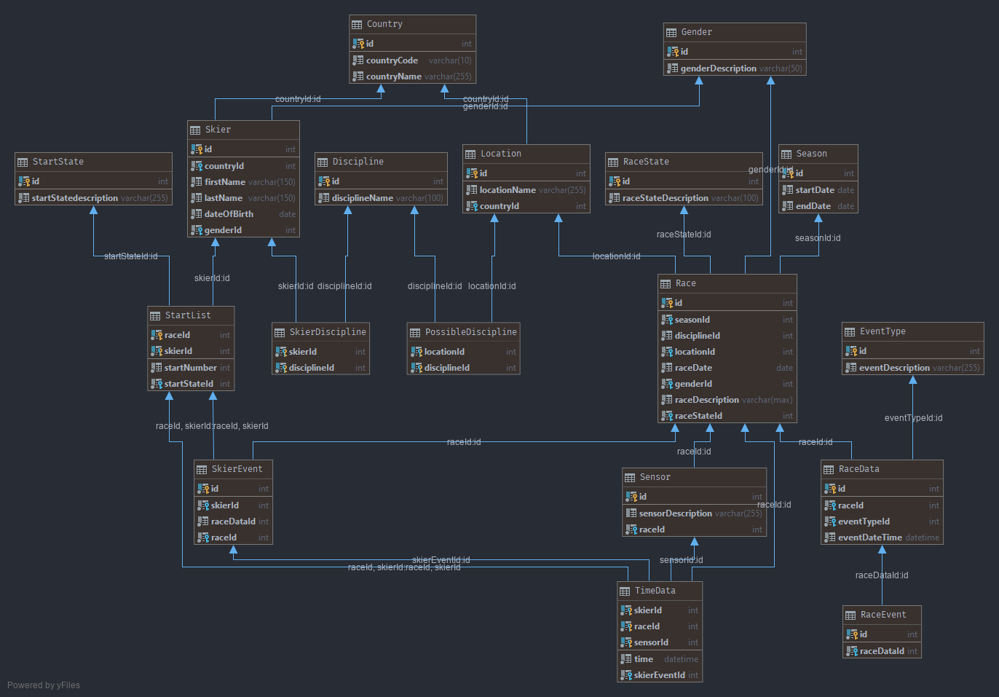

# Hurace 

## Datenbank
Die Datenbank von Hurace besteht aus folgenden 18 Tabellen. In nachfolgendem Diagramm ist zu sehen, wie diese zusammenhängen.

### Tabellen

#### Country
Diese Tabelle stellt eine Land mit Ländername und Ländercode dar. 

#### Discipline
Diese Tabelle stellt eine Schidisziplin dar.

#### EventType
In dieser Tabelle wird ein Event-Typ für ein [RaceData](#racedata) dargestellt.
Diese Tabelle erfüllt die Funktion einer Enumeration für die verschiedenen Event-Typen.

#### Gender
Diese Tabelle stellt das Geschlecht dar und dient als Enumeration.

#### Location
Die Location Tabelle modelliert einen Rennort.

#### PossibleDiscipline
In dieser Tabelle wird abgebildet, welche Disziplinen an einem bestimmten Ort möglich sind.

#### Race

#### RaceData
Diese Tabe

#### RaceEvent

#### RaceState

#### Season

#### Sensor

#### Skier

#### SkierDiscipline

#### SkierEvent

#### StartList

#### StartState

#### TimeData