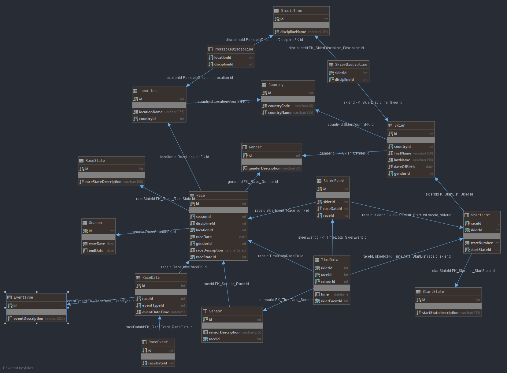

# Hurace

## Datenbank

Die Datenbank von Hurace besteht aus folgenden 18 Tabellen. In nachfolgendem Diagramm ist zu sehen, welche Spalten jeweils definiert sind und wie diese zusammenhängen.

### Tabellen

#### Country

Stellt ein Land dar.

#### Discipline

Stellt eine Disziplin dar.

#### EventType

Stellt den Typ eines möglichen Events dar, welches während eines Rennens passieren kann. Solche Events werden in RaceData gespeichert.

#### Gender

Stellt das Geschlecht dar, dieses wird um das Geschlecht eines Rennens und das eines Schirennläufers eindeutig zu definieren.

#### Location

Stellt einen Rennort dar und besitzt zudem eine Referenz auf ein Land in dem sich der Ort befindet.

#### PossibleDiscipline

Dies ist eine Assoziativtabelle zwischen [Discipline](#discipline) und [Location](#location). Hier wird dargestellt, welche Disziplinen an welchen Orten möglich sind. 

#### Race

Stellt ein Rennen dar. Zusätzlich zu den informellen Spalten wird zudem eine Referenz auf ein [RaceState](#racestate) gespeichert, welcher den aktuellen Zustand des Rennens angibt.

#### RaceData

Diese Tabelle stellt ein Event-Log für ein Rennen dar. Hier werden alle Ereignisse eines Rennens gespeichert. Mittels eines [EventTypes](#eventtype) wird bestimmt um welches Event es sich handelt.

#### RaceEvent

Dies ist eine spezifizierte Ausführung von RaceData, welche ein Rennevent (z.B. Rennstart, Abbruch) darstellt.

#### RaceState

Stellt den Zustand eines Rennens dar. Dieser könnte z.B. Gestartet, Abgeschlossen oder Abgebrochen sein.

#### Season

Stellt eine Schisaison dar.

#### Sensor

Stellt einen Sensor dar, dieser hat eine Referenz auf ein Rennen. Dies folgt daraus, das sich die Anzahl der Sensoren von Rennen zu Rennen ändern können auch wenn diese am selben Rennort stattfinden.

#### Skier

Stellt einen Schirennläufer dar.

#### SkierDiscipline

Stellt dar, welche Disziplinen ein Schirennläufer fährt.

#### SkierEvent

Dies ist eine spezifizierte Ausführung von RaceData, welche ein Event eines Skirennläufers darstellt. Dabei kann es sich z.B. um eine Disqualifikation oder um eine Zwischenzeit handeln.

#### StartList

Hier wird die Startreihenfolge eines Rennens dargestellt. Diese Tabelle referenziert einen Skirennläufer sowie ein Rennen.
Um doppelte Einträge zu vermeiden, kann ein Schirennläufer nur 1x für ein Rennen eingetragen werden.
Zudem wird der aktuelle Startzustand gespeichert, dieser kann z.B. Ausfall, Fertig oder im Starthaus wartend sein.

#### StartState

Stellt den Zustand eines StartListen-Eintrags dar. Dieser kann z.B. Fertig, Wartend oder Ausgefallen sein.

#### TimeData

Stellt eine Zwischenzeit dar. Es wird eine Referenz auf ein SkierEvent gespeichert um speichern zu können, wann eine Zwischenzeit passiert ist.
Zudem wird der Sensor referenziert, welcher die Zwischenzeit aufgenommen hat.
Dabei kann ein Skirennläufer nur eine Zwischenzeit pro Rennen für einen Sensor besitzen.
Weiters wird nicht ein Rennläufer direkt sondern eine StartList referenziert um sicherzugehen, dass der Schiläufer antritt bei dem jeweiligen Rennen.

## Database Access Layer

Der Database Access Layer (DAL) stellt eine Möglichkeit zur Verfügung, die Daten in der Datenbank zu manipulieren, ohne direkt Queries absetzen zu müssen.
Die DAL teilt sich dabei in zwei Bereiche auf:

- Interfaces, welche die Methoden definieren, mit welchen die Daten manipuliert werden können
- Database Access Objects, welche eine konkrete Implementierung der Interfaces für eine Datenbank zur Verfügung stellen.

### Interfaces

Um verschiedenste Datenbanken zu ermöglichen, werden die Methoden in Interfaces definiert, welche von den DAOs implementiert werden.
Die Basis bilden 4 Basis Interfaces:

- IReadonlyBaseDao
- IDefaultReadonlyBaseDao
- ICrudDao
- IDefaultCrudDao

Diese definieren möglichst modular die nötigen Methoden, welche jedes DAO benötigt (z.B. FindAll, Insert).
Alle konkreten DAO Interfaces erben von diesen und fügen nach Bedarf Methoden hinzu.

Die Vererbungshierarchie aller Interfaces sieht wie folgt aus:

Die DAO-Interfaces lassen sich in vier Bereiche gliedern.
Zum einen gibt es ReadonlyDAOs, diese definieren lediglich 

Anzumerken ist dabei, dass *ITimeDataDao* und *IStartListDao* direkt von *ICrudDao* erben, da die jeweiligen Tabellen einen zusammengesetzten Primärschlüssel haben und deshalb kein generisches *FindByIdAsync* wie in *IDefaultReadonlyDao* möglich ist.

Zu sehen ist ebenfalls, dass die Interfaces von *ILocationDao* und *ISkierDao* zusätzliche Methoden besitzen.
Dies ist der Fall da es eine Assoziativtabelle zwischen *Location* und *Discipline* sowie eine zwischen *Skier* und *Discipline* gibt. Die Methoden zum Manipulieren dieser Beziehungen ist in *ILocationDao* respektive *ISkierDao* definiert.

### Database Access Objects