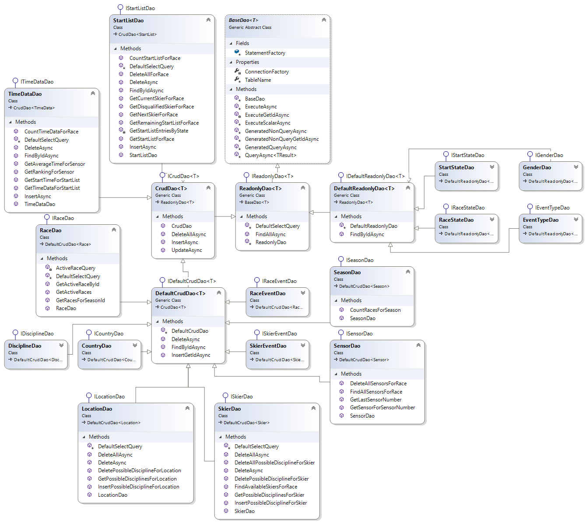

# Hurace

## Datenbank

Die Datenbank von Hurace besteht aus folgenden 18 Tabellen. In nachfolgendem Diagramm ist zu sehen, welche Spalten jeweils definiert sind und wie die Tabellen zusammenhängen.

### Tabellen

#### Country

Stellt ein Land dar.

#### Discipline

Stellt eine Disziplin dar.

#### EventType

Stellt den Typ eines möglichen Events dar, welches während eines Rennens passieren kann. Solche Events werden in RaceData gespeichert.

#### Gender

Stellt das Geschlecht dar, dieses wird um das Geschlecht eines Rennens und das eines Schirennläufers eindeutig zu definieren.

#### Location

Stellt einen Renn-Ort dar und besitzt zudem eine Referenz auf ein [Country](#country) in dem sich der Ort befindet.

#### PossibleDiscipline

Dies ist eine Assoziativtabelle zwischen [Discipline](#discipline) und [Location](#location). Hier wird dargestellt, welche Disziplinen an welchen Orten möglich sind.

#### Race

Stellt ein Rennen dar. Zusätzlich zu den informellen Spalten wird zudem eine Referenz auf ein [RaceState](#racestate) gespeichert, welcher den aktuellen Zustand des Rennens angibt.

#### RaceData

Diese Tabelle stellt ein Event-Log für ein Rennen dar. Hier werden alle Ereignisse eines Rennens gespeichert. Mittels eines [EventTypes](#eventtype) wird bestimmt um welches Event es sich handelt.

#### RaceEvent

Dies ist eine spezifizierte Ausführung von [RaceData](#racedata), welche ein Rennevent (z.B. Rennstart, Abbruch) darstellt.

#### RaceState

Stellt den Zustand eines Rennens dar. Dieser könnte z.B. Gestartet, Abgeschlossen oder Abgebrochen sein.

#### Season

Stellt eine Schisaison dar.

#### Sensor

Stellt einen Sensor dar, dieser hat eine Referenz auf ein [Race](#race). Dies folgt daraus, das sich die Anzahl der Sensoren von Rennen zu Rennen ändern können auch wenn diese am selben [Location](#location) stattfinden.

#### Skier

Stellt einen Schirennläufer dar.

#### SkierDiscipline

Stellt dar, welche Disziplinen ein Schirennläufer fährt.

#### SkierEvent

Dies ist eine spezifizierte Ausführung von RaceData, welche ein Event eines Skirennläufers darstellt. Dabei kann es sich z.B. um eine Disqualifikation oder um eine Zwischenzeit handeln.

#### StartList

Hier wird die Startreihenfolge eines Rennens dargestellt. Diese Tabelle referenziert einen Skirennläufer sowie ein Rennen.
Um doppelte Einträge zu vermeiden, kann ein Schirennläufer nur 1x für ein Rennen eingetragen werden.
Zudem wird der aktuelle Startzustand gespeichert, dieser kann z.B. Ausfall, Fertig oder im Starthaus wartend sein.

#### StartState

Stellt den Zustand eines StartListen-Eintrags dar. Dieser kann z.B. Fertig, Wartend oder Ausgefallen sein.

#### TimeData

Stellt eine Zwischenzeit dar. Es wird eine Referenz auf ein SkierEvent gespeichert um speichern zu können, wann eine Zwischenzeit passiert ist.
Zudem wird der Sensor referenziert, welcher die Zwischenzeit aufgenommen hat.
Dabei kann ein Skirennläufer nur eine Zwischenzeit pro Rennen für einen Sensor besitzen.
Weiters wird nicht ein Rennläufer direkt sondern eine StartList referenziert um sicherzugehen, dass der Schiläufer antritt bei dem jeweiligen Rennen.

## Database Access Layer

Der Database Access Layer (DAL) stellt eine Schnittstelle zur Verfügung, die Daten in der Datenbank zu manipulieren, ohne direkt Queries absetzen zu müssen.
Die DAL teilt sich dabei in zwei Bereiche auf:

- Interfaces, welche die Methoden definieren, mit welchen die Daten manipuliert werden können
- Database Access Objects, welche eine konkrete Implementierung der Interfaces für eine konkrete Datenbank zur Verfügung stellen.

Jedes DAO repräsentiert dabei eine Datenbanktabelle.

### Interfaces

Um verschiedene Datenbanksysteme realisieren zu können, werden die Methoden in Interfaces definiert, welche von den konkreten DAOs implementiert werden.
Da einige Methoden gleich aussehen und in allen DAOs verfügbar sein sollten, gibt es die vier Basis Interfaces von denen geerbt werden kann. Zudem gibt es einige Interface, welche zusätzliche Methoden definieren. Jene Interfaces, welche nur von den Basis Interfaces erben sind hier nicht näher beschrieben. Die gesamte Vererbungshierarchie sieht wie folgt aus:

#### IReadonlyDao

Dieses Interface definiert eine _FindAllAsync_ Methode welche in allen DAOs verfügbar sein soll.

#### IDefaultReadonlyDao

Dieses Interface erbt von [IReadonlyDao](#ireadonlydao) und definiert eine _FindByIdAsync_ Methode mit welcher ein Eintrag anhand der Id retourniert.

#### ICrudDao

Dieses Interface erbt von [IReadonlyDao](#ireadonlydao) und definiert die Basis Crud Methoden:

- UpdateAsync
- InsertAsync
- DeleteAllAsync

Falls ein DAO eine Entität verwaltet die z.B. einen zusammengesetzten Primärschlüssel besitzt, kann von diesem Interface geerbt werden.

#### IDefaultCrudDao

Dieses Interface erbt sowohl von [IReadonlyDao](#ireadonlydao) als auch von [ICrudDao](#icruddao) und definiert CRUD Methoden für Entitäten mit einer einzelnen Id als Primärschlüssel:

- InsertGetIdAsync
- DeleteAsync

#### ITimeDataDao

Dieses Interface erbt von [ICrudDao](#icruddao). Dadurch das [TimeData](#timedata) keinen eindeutigen Primärschlüssel besitzt sondern sich dieser aus der Id des [Skiers](#skier) und der Id des [Races](#race) zusammensetzt müssen _DeleteAsync_ und _FindByIdAsync_ eigen definiert werden. Zudem definiert dieses Interface eine Methode _GetRankingForRace_ diese liefert den aktuellen Stand des Rennens.

#### IStartListDao

Dieses Interface erbt von [ICrudDao](#icruddao). Gleich wie bei [ITimeDataDao](#itimedatadao) müssen _DeleteAsync_ und _FindByIdAsync_ eigen definiert werden. Dieses Interface definiert zudem eine Methode _GetCurrentSkierForRace_ zum Ermitteln des aktuellen Rennläufers, sowie eine Methode _GetNextSkierForRace_ zum Ermitteln des nächsten Rennläufers. Weiters gibt es eine Methode _GetStartListForRace_ welche die Startliste eines Rennens ermittelt.

#### ILocationDao

Dieses Interface erbt von [IDefaultCrudDao](#idefaultcruddao). In diesem Interface wird auch die Tabelle [PossibleDiscipline](#possiblediscipline) mit verwaltet. Deshalb sind diese Methoden definiert:

- DeletePossibleDisciplineForLocation
- GetPossibleDisciplineForLocation
- InsertPossibleDisciplineForLocation

#### ISkierDao

Dieses Interface erbt von [IDefaultCrudDao](#idefaultcruddao). In diesem Interface wird auch die Tabelle [SkierDiscipline](#skierdiscipline) mit verwaltet. Deshalb sind diese Methoden definiert:

- DeletePossibleDisciplineForSkier
- GetPossibleDisciplinesForSkier
- InsertPossibleDisciplineForSkier

### Database Access Objects

Die Database Access Objects (DAOs) sind eine konkrete Implementierung der [Interfaces](#interfaces).
Konkret stellen diese einen Zugriff auf eine MSSQL Datenbank zur Verfügung.
Gleich wie bei den [Interfaces](#interfaces) gibt es auch bei Basisklassen mit den gleichen Namen, die die jeweiligen Interfaces implementieren. Weiters gibt es eine _BaseDao_ Klasse welche über Methoden zum Ansprechen der Datenbank verfügt.
Im folgenden Diagram ist die Vererbungshierarchie der DAOs zu sehen.

