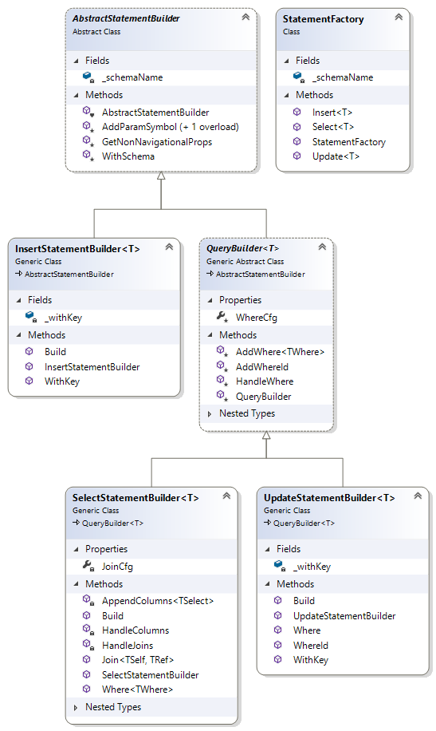

# Hurace

## Setup
Um Hurace in Betrieb zu nehmen muss ein Datenbank-Server zur Verfügung stehen. 
In ```src/Datenbank``` befindet sich ein Script, welches einen SQL Server Container anlegt.
Anschließend müssen auf dem Datenbank Server die Test und die Produktivdatenbank angelegt werden.
Die Scripts zum Erstellen befinden sich ebenfalls in ```scr/Datenbank```. Diese sind für den SQL Server 2016 und 2019 verfügbar.

## Datenbank

Die Datenbank von Hurace besteht aus folgenden 18 Tabellen. In nachfolgendem Diagramm ist zu sehen, welche Spalten jeweils definiert sind und wie die Tabellen zusammenhängen.


Bei der Datenbank handelt es sich um eine SQL Server Datenbank.

### Tabellen

#### Country

Stellt ein Land dar.

#### Discipline

Stellt eine Disziplin dar.

#### EventType

Stellt den Typ eines möglichen Events dar, welches während eines Rennens passieren kann. Solche Events werden in [RaceData](#racedata) gespeichert.

#### Gender

Stellt das Geschlecht dar.
Dies ist in einer eigenen Tabelle ausgelagert, um das Geschlecht eines Rennens und das eines Schirennläufers eindeutig zu definieren. 

#### Location

Stellt einen Renn-Ort dar und besitzt zudem eine Referenz auf ein [Country](#country) in dem sich der Ort befindet.

#### PossibleDiscipline

Dies ist eine Assoziativtabelle zwischen [Discipline](#discipline) und [Location](#location). Hier wird dargestellt, welche Disziplinen an welchen Orten möglich sind.

#### Race

Stellt ein Rennen dar. Zusätzlich zu den informellen Spalten wird zudem eine Referenz auf ein [RaceState](#racestate) gespeichert, welcher den aktuellen Zustand des Rennens angibt.

#### RaceData

Diese Tabelle stellt ein Event-Log für ein Rennen dar. Hier werden alle Ereignisse eines Rennens gespeichert. Mittels eines [EventTypes](#eventtype) wird bestimmt um welches Event es sich handelt. Diese Tabelle bildet eine Vererbungshierarchie ab, wobei die Tabellen [RaceEvent](#raceevent) und [SkierEvent](#skierevent) spezifischere Infos enthalten und eine Referenz auf diese Tabelle besitzen.

#### RaceEvent

Dies ist eine spezifizierte Ausführung von [RaceData](#racedata), welche ein Rennevent (z.B. Rennstart, Abbruch) darstellt.

#### RaceState

Stellt den Zustand eines Rennens dar. Dieser könnte z.B. Gestartet, Abgeschlossen oder Abgebrochen sein.

#### Season

Stellt eine Schisaison dar.

#### Sensor

Stellt einen Sensor dar, dieser hat eine Referenz auf ein [Race](#race). Dies folgt daraus, das sich die Anzahl der Sensoren von Rennen zu Rennen ändern können auch wenn diese am selben [Location](#location) stattfinden.

#### Skier

Stellt einen Schirennläufer dar.

#### SkierDiscipline

Stellt dar, welche Disziplinen ein Schirennläufer fährt.

#### SkierEvent

Dies ist eine spezifizierte Ausführung von RaceData, welche ein Event eines Skirennläufers darstellt. Dabei kann es sich z.B. um eine Disqualifikation oder um eine Zwischenzeit handeln.

#### StartList

Hier wird die Startreihenfolge eines Rennens dargestellt. Diese Tabelle referenziert einen Skirennläufer sowie ein Rennen.
Um doppelte Einträge zu vermeiden, kann ein Schirennläufer nur einmal für ein Rennen eingetragen werden.
Zudem wird der aktuelle Startzustand gespeichert, dieser kann z.B. Ausfall, Fertig oder im Starthaus wartend sein.

#### StartState

Stellt den Zustand eines StartListen-Eintrags dar. Dieser kann z.B. Fertig, Wartend oder Ausgefallen sein.

#### TimeData

Stellt eine Zwischenzeit dar. Es wird eine Referenz auf ein SkierEvent gespeichert um speichern zu können, wann eine Zwischenzeit passiert ist.
Zudem wird der Sensor referenziert, welcher die Zwischenzeit aufgenommen hat.
Dabei kann ein Skirennläufer nur eine Zwischenzeit pro Rennen für einen Sensor besitzen.
Weiters wird nicht ein Rennläufer direkt sondern eine StartList referenziert um sicherzugehen, dass der Schiläufer antritt bei dem jeweiligen Rennen.

### Demodaten 
Die Demodaten werden zum Großteil generiert. Basis dafür bildet ein JSON-File mit dem Namen, Herkunft und Geschlecht der Schirennläufer. Zudem werden Daten für Länder, Locations, Saisonen und Disziplinen eingefügt.

Bei der Saison wird standardmäßig das Start und Enddatum der Saison 2018/19 eingefügt.
Für die Länder werden die bekanntesten Schination eingefügt bzw. jene die in der JSON Datei der Schiläufer verwendet werden.
Die Rennorte sind bekannte Orte, an welchen Rennen in der Saison 2018/19 in echt stattfinden.

Für jeden Schirennläufer wird ein Geburtsdatum generiert. Weiters werden die möglichen Disziplinen der Schirennläufer erstellt.
Schirennen werden zufällig in der Saison verteilt, dabei wird geachtet, dass nicht zwei Rennen am selben Tag stattfinden.
Für die Testdaten werden nur Schirennen nur für Männer erstellt um die Anzahl der Schifahrer geringer zu halten. 
Anschließend werden Rennen generiert und für jedes Rennen fünf Sensoren angelegt.
Weiters wird für jedes Rennen jeder männlicher Schirennläufer in die Start Liste eingetragen.

Anschließend werden die Rennläufe generiert. 
Dabei wird für jedes Rennen die Startliste durchlaufen. Der Startzeitpunkt jedes Rennens ist um 12 Uhr des Renntages. Die Zwischenzeiten werden zufällig erstellt. Zwischenzeiten sind durchschnittlich 20 Sekunden auseinander, wobei dieser Wert um bis zu einer Sekunde abweichen kann.

## Database Access Layer

Der Database Access Layer (DAL) stellt eine Schnittstelle zur Verfügung, die Daten in der Datenbank zu manipulieren, ohne direkt Queries absetzen zu müssen.
Die DAL teilt sich dabei in zwei Bereiche auf:

- Interfaces, welche die Methoden definieren, mit welchen die Daten manipuliert werden können
- Database Access Objects, welche eine konkrete Implementierung der Interfaces für eine konkrete Datenbank zur Verfügung stellen.

Jedes DAO repräsentiert dabei eine Datenbanktabelle.

### Interfaces

Um verschiedene Datenbanksysteme realisieren zu können, werden die Methoden in Interfaces definiert, welche von den konkreten DAOs implementiert werden.
Da einige Methoden gleich aussehen und in allen DAOs verfügbar sein sollten, gibt es die vier Basis Interfaces von denen geerbt werden kann. Zudem gibt es einige Interface, welche zusätzliche Methoden definieren. Jene Interfaces, welche nur von den Basis Interfaces erben sind hier nicht näher beschrieben. Die gesamte Vererbungshierarchie sieht wie folgt aus:


#### IReadonlyDao

Dieses Interface definiert eine _FindAllAsync_ Methode welche in allen DAOs verfügbar sein soll.

#### IDefaultReadonlyDao

Dieses Interface erbt von [IReadonlyDao](#ireadonlydao) und definiert eine _FindByIdAsync_ Methode mit welcher ein Eintrag anhand der Id retourniert.

#### ICrudDao

Dieses Interface erbt von [IReadonlyDao](#ireadonlydao) und definiert die Basis Crud Methoden:

- UpdateAsync
- InsertAsync
- DeleteAllAsync

Falls ein DAO eine Entität verwaltet die z.B. einen zusammengesetzten Primärschlüssel besitzt, kann von diesem Interface geerbt werden.

#### IDefaultCrudDao

Dieses Interface erbt sowohl von [IReadonlyDao](#ireadonlydao) als auch von [ICrudDao](#icruddao) und definiert CRUD Methoden für Entitäten mit einer einzelnen Id als Primärschlüssel:

- InsertGetIdAsync
- DeleteAsync

#### ITimeDataDao

Dieses Interface erbt von [ICrudDao](#icruddao). Dadurch das [TimeData](#timedata) keinen eindeutigen Primärschlüssel besitzt sondern sich dieser aus der Id des [Skiers](#skier) und der Id des [Races](#race) zusammensetzt müssen _DeleteAsync_ und _FindByIdAsync_ eigen definiert werden. Zudem definiert dieses Interface eine Methode _GetRankingForRace_ diese liefert den aktuellen Stand des Rennens.

#### IStartListDao

Dieses Interface erbt von [ICrudDao](#icruddao). Gleich wie bei [ITimeDataDao](#itimedatadao) müssen _DeleteAsync_ und _FindByIdAsync_ eigen definiert werden. Auch hier besteht der Primärschlüssel aus der Id des [Skiers](#skier) und der Id des [Races](#race). Dieses Interface definiert zudem eine Methode _GetCurrentSkierForRace_ zum Ermitteln des aktuellen Rennläufers, sowie eine Methode _GetNextSkierForRace_ zum Ermitteln des nächsten Rennläufers. Weiters gibt es eine Methode _GetStartListForRace_ welche die Startliste eines Rennens ermittelt.

#### ILocationDao

Dieses Interface erbt von [IDefaultCrudDao](#idefaultcruddao). In diesem Interface wird auch die Tabelle [PossibleDiscipline](#possiblediscipline) mit verwaltet. Deshalb sind diese Methoden definiert:

- DeletePossibleDisciplineForLocation
- GetPossibleDisciplineForLocation
- InsertPossibleDisciplineForLocation

#### ISkierDao

Dieses Interface erbt von [IDefaultCrudDao](#idefaultcruddao). In diesem Interface wird auch die Tabelle [SkierDiscipline](#skierdiscipline) mit verwaltet. Deshalb sind diese Methoden definiert:

- DeletePossibleDisciplineForSkier
- GetPossibleDisciplinesForSkier
- InsertPossibleDisciplineForSkier

### Domain Objects / Data Transfer Objects

Domain Objects bzw. Data Transfer Objects (DTOs) dienen dazu die Tabellen als Klassen abzubilden.
Bis auf die Tabellen [PossibleDiscipline](#possiblediscipline) und [SkierDiscipline](#skierdiscipline) gibt es für jede Tabelle ein eigenes DTO. Die Spaltennamen werden als Properties modelliert.
In den DTOs kommen zwei Attribute zum Einsatz um das Mappen zu erleichtern.
Für Primärschlüssel wird das _KeyAttribute_ von _System.ComponentModel.DataAnnotations_ verwendet.
Weiters sind in jedem DTO die referenzierten Tabellen als Properties verfügbar (z.B. [Country](#country) bei [Skier](#skier)). Diese werden mit dem _NavigationalAttribut_ gekennzeichnet.

### Database Access Objects

Die Database Access Objects (DAOs) sind eine konkrete Implementierung der [Interfaces](#interfaces).
Konkret stellen diese einen Zugriff auf eine MSSQL Datenbank zur Verfügung.
Gleich wie bei den [Interfaces](#interfaces) gibt es auch bei Basisklassen mit den gleichen Namen, die die jeweiligen Interfaces implementieren. Weiters gibt es eine _BaseDao_ Klasse welche über Methoden zum Ansprechen der Datenbank verfügt. Diese Methoden verwenden ADO.NET um Die Daten aus der Datenbank zu laden. Wie die Daten in Domänenklassen gemappt werden, wird in [Mapper](#mapper) beschrieben.
Im folgenden Diagram ist die Vererbungshierarchie der DAOs zu sehen.


Sämtliche Funktionalität ist dabei in _BaseDao_ untergebracht. Zudem besitzt diese Klasse eine _ConnectionFactory_ mit welcher eine Datenbankverbindung aufgebaut werden und anschließend SQL-Statements ausgeführt werden können.
Weiters steht eine [StatementFactory](#statementfactory) zur Verfügung, welche einfache SQL Statements erzeugen kann.
Die wichtigsten Methoden sind im Anschluss beschrieben.

#### QueryAsync

Diese Methode führt eine Query aus und liefert eine List an generischen Ergebnissen.
Dabei wird ein Statement und optional Query Parameter übernommen.Ein Query Parameter besteht dabei aus einem Key und einem Value. Der Key gibt an, wo der Value des Query Parameters im SQL Statement eingefügt werden soll. Dies dient dazu SQL-Injection zu verhindern.Zudem kann noch eine Konfiguration für den [Mapper](#mapper) übergeben werden. Zuerst wird mittels der _ConnectionFactory_ ein _DbCommand_ erzeugt. Anschließend wird das Statement ausgeführt und die Ergebnisse mittels des [Mappers](#mapper) gemappt und retourniert.

#### ExecuteAsync

Diese Methode führt ein Statement auf der Datenbank aus, dabei kann es sich z.B. um ein Update, Insert oder Delete Statement handeln. Diese Methode übernimmt ein Statement sowie die Query Parameter dafür. Anschließend wird wie bei [QueryAsync](#queryasync) ein _DbCommand_ erzeugt, mit welchem das Statement ausgeführt wird.

#### ExecuteGetIdAsync

Diese Methode funktioniert ähnlich wie [ExecuteAsync](#executeasync). Der Unterschied ist der, dass bei dieser Methode die letzte generierte Id returniert wird.

#### Mapper

Um nicht manuell einen Mapper für jedes DTO schreiben zu müssen, wird diese Funktionalität in einen Mapper ausgelagert. Dieser hat eine generische Methode _MapTo_. Der Mapper durchläuft alle Properties des angegebenen generischen Typen und holt sich mittels des Property Names einen Wert aus dem ebenfalls übergebenen _IDataRecord_. _IDataRecord_ enthält alle Daten welche aus der ausgeführten Query zurückkommen. Ist ein Property mit dem _NavigationAttribute_ gekennzeichnet, so wird _MapTo_ rekursiv aufgerufen und die Properties dieses Typen gemappt.
Mittels einer [MapperConfig](#mapperconfig) kann konfiguriert werden, dass z.B ein Property einen Wert erhält welcher unter einem anderen Namen aus der Datenbank geholt wird. Beispielsweise wird für einen [Skier](#skier) der [Country](#country) mitgeladen. Damit die beiden Id Spalten nicht kollidieren, wird die Id des [Countries](#country) als _countryId_ geladen, in der [MapperConfig](#mapperconfig) kann konfiguriert werden, dass die Werte trotzdem richtig zugeordnet werden. Weiters wird mit der [MapperConfig](#mapperconfig) angegeben, welche referenzierten Entitäten geladen werden sollen.

##### MapperConfig
Eine MapperConfig bietet vier Methoden, zwei zum Konfigurieren und zwei zum Auslesen. 
Mittels _AddMapping_ können für einen generischen Mappings definiert werden. Dabei wird eine Liste von Tuplen übernommen mit jeweils dem Namen der Spalte und der Name des Properties auf welchen gemappt werden soll.
Zudem gibt es eine Methode _Include_ diese nimmt einen generischen Typen. Mit dieser Methode wird bestimmt, dass eine Property mit dem _NavigationalAttribute_ ebenfalls gemappt werden soll. Diese Methode wird bei _AddMapping_ automatisch aufgerufen.

Mit _IsIncluded_ kann herausgefunden werden ob ein Property mit dem _NavigationalAttribute_ inkludiert werden soll und mit _MappingExists_ wird geprüft ob für einen Typen und dessen Property ein Mapping existiert.

#### StatementFactory

Um simple Select Statements nicht jedes mal schreiben zu müssen, wird eine _StatementFactory_ zur Verfügung gestellt. Diese ermöglicht es Select, Insert und Update Queries anhand eines generischen Typen zu generieren. Einer der drei Builder kann mittels der jeweiligen Methoden erzeugt werden, der generische Typ gibt dabei an, auf welche Tabelle das Statement ausgeführt wird.
Die Vererbungshierarchie sieht wie folgt aus:



Einige Methoden sind für mehreren StatementBuilder verfügbar:

##### Where
Die Where Methode ist sowohl für den [UpdateStatementBuilder](#updatestatementbuilder) als auch für den [SelectStatementBuilder](#selectstatementbuilder) verfügbar. Diese Methode nimmt einen generischen Typen sowie eine Liste von Query Parametern. Der Name des generischen Typen wird als Name der Tabelle herangezogen auf welcher die Where Condition zutrifft.

Die drei StatementFactories bieten zudem folgende Methoden

##### SelectStatementBuilder

###### Join
Mit der Join Methode können Tabellen gejoined werden.
Die Methode nimmt zwei generische Typen und eine Liste von Join Parametern. Diese bestehen aus zwei Strings, welche die Spaltennamen angeben, welche beim Join verglichen werden sollen. Der Name des ersten generischen Typs steht für die Tabelle von welcher aus gejoined wird und der Name des zweiten Typs für die Tabelle auf welche gejoined wird. Diese Dinge werden zwischengespeichert und später beim Aufruf von [Build](#build) wieder abgerufen.

###### Build - Select
Die Build Methode baut aus den konfigurierten Einstellungen ein SQL Statement mit Query Parametern sowie einer MapperConfig zusammen. Zuerst werden die Properties des generischen Typen durchlaufen und dabei werden die Namen der Properties als Spaltennamen in das Select Statement eingefügt, der Name des generischen Typen wird als Tabellenname herangezogen. Dies wird auch für die Spalten der gejointen Tabellen gemacht.
Anschließend werden die Join Constraints eingefügt. Zuletzt werden die Where Conditions aus [Where](#where) eingefügt.

##### UpdateStatementBuilder

###### WhereId
Diese Methode erlaubt es automatisch die Primärschlüssel einer Entität als Where Conditions festzulegen. Dies geschieht mithilfe des _KeyAttributes_.

###### Build - Update
Diese Methode baut wiederum ein Statement aus der Konfiguration zusammen. Dabei werden die Namen der Properties des generischen Datentypes als Spalten eingefügt. Navigations Properties werden dabei ignoriert. Aus der Wertebelegung der Properties werden zudem die Query Parameter generiert.
Zuletzt werden noch die Where Conditions eingefügt.


##### InsertQueryBuilder

###### Build - Insert
Diese Methode funktioniert ähnlich zu [Build - Update](#build---update), außer, dass die hier keine Where Conditions eingefügt werden.

## Unit Tests

Die Unit Tests decken jeweils die Methoden
* FindAll
* FindById
* Insert
* Update
* Delete
* DeleteAll

ab. Wobei bei lesenden Daos nur die ersten beiden getestet werden. 
Der Test muss für alle Daos durchgeführt werden, obwohl die meisten Methoden generisch implementiert wurden,
da diese auf unterschiedliche Tabellen zugreifen.

## Businesslogik

Die Businesslogik von Hurace wird in folgende Services aufgeteilt, diese greifen auf die Database Access Layer zu und werden von den ViewModels genutzt.

### RaceBaseDataService

In diesem Service sind folgende Methoden definiert, welche zum Modifizieren von Rennen benötigt werden.


#### GetRace

Liefert ein Rennen anhand einer Id

#### InsertOrUpdateRace

Fügt ein Rennen ein oder aktualisiert ein bestehendes Rennen.
Ein Rennen kann nur aktualisiert werden, wenn keine Startliste definiert ist, oder sich Geschlecht und Disziplin nicht ändern.
Weiters werden Sensoren hinzugefügt oder entfernt.

#### GetSensorCount

Liefert die Anzahl der Sensoren welche für ein Rennen sind.

#### RemoveRace

Entfernt ein Rennen. Dies ist nur möglich, falls keine Startliste definiert ist, bzw. keine Zeitdaten vorliegen.
Sensoren werden mitgelöscht.

#### GetGenders

Liefert alle zur Auswahl stehenden Geschlechter.

#### GetLocations

Liefert alle zur Auswahl stehenden Rennorte.

#### GetDisciplinesForLocations

Liefert alle Disziplinen welche an einem Rennort möglich sind.


### RaceStartListService

In diesem Service werden Methoden zum Manipulieren der Startliste definiert.

#### UpdateStartList

In dieser Methode wird die Startliste eines Rennens aktualisiert. Dafür werden alle Einträge gelöscht. Anschließend werden die neuen Einträge eingefügt.

#### GetAvailableSkiersForRace

Liefert alle Skifahrer welche zu einer Startliste eines Rennens hinzugefügt werden können.

#### GetStartListForRace

Liefert die Startliste für ein Rennen

#### IsStartListDefined

Gibt an ob für ein Rennen eine Startliste definiert ist

#### GetStartListById

Liefert einen einzelnen Startlisteneintrag anhand dessen Id.

### RaceStatService

In diesem Service sind Methoden definiert, mit welchen Statistikdaten eines Rennens abgerufen werden können.

#### GetRankingForRace

In dieser Methode wird das komplette Ranking eines Rennens retourniert. Dabei werden ausgeschiedene Fahrer am Ende angeführt.

#### GetFinishedSkierRanking

Diese Methode liefert die Rangliste der Fahrer, welche das Rennen erfolgreich beendet haben. Dabei wird auch berücksichtigt, dass die Position entsprechend angepasst wird, falls zwei Fahrer die gleiche Zeit gefahren sind.

#### GetDisqualifiedSkiers 

Liefert die Rennfahrer, welche ausgeschieden sind.

#### GetTimeDataForStartList

Liefert alle Sensorwerte für einen Schirennläufer.

#### GetDifferenceToLeader

Liefert für eine Sensorauslösung den Unterschied zum Führenden. Falls der Fahrer selbst der Führende ist, wird der Abstand zum nächsten retourniert.

#### GetTimeDataForSkierWithDifference

Liefert alle Zwischenzeiten, mit dem Abstand zum Führenden.

#### GetStartTimeForSkier

Liefert den Zeitpunkt bei welchem der Skier gestartet ist.

### SeasonService

Dieser Service stellt Methoden zum Abfragen von Saisondaten zur Verfügung.

#### GetRacesForSeason

Liefert alle Rennen einer Saison

#### GetAllSeasons 

Liefert alle Saisons.

### ActiveRaceControlService

In diesem Service werden zum einen Events definiert, welche über Ereignisse informieren und zum anderen werden Methoden definiert, welche für den Rennablauf benötigt werden.

#### Events

##### OnSkierStarted

Wird ausgelöst sobald die Rennstrecke freigegeben wurde. 

##### OnSkierFinished

Wird ausgelöst sobald ein Rennfahrer im Ziel angekommen ist.

##### OnSkierCancelled

Wird ausgelöst, wenn ein Rennfahrer nicht antritt.

##### OnCurrentSkierDisqualified

Wird ausgelöst, wenn der aktuelle Rennfahrer ausgeschieden ist.

##### OnLateDisqualification

Wird ausgelöst, wenn ein Rennfahrer im Nachhinein disqualifiziert wurde.

##### OnSplitTime

Wird ausgelöst, wenn ein ein Sensor ausgelöst wurde.

##### OnRaceCancelled

Wird ausgelöst, wenn ein ein Rennen abgebrochen wurde.

##### OnRaceFinished

Wird ausgelöst, wenn ein Rennen beendet wurde.

#### Methoden

##### OnTimingTriggered

Diese Methode wird aufgerufen, wenn ein Sensor ausgelöst wurde.
Zuerst wird mittels ```ValidateSensorValue``` geprüft ob der Wert valide ist und anschließend wird wird der Wert in der Datenbank abgelegt falls er valide war. Falls der ausgelöste Sensor der Zielsensor war, wird der Lauf des Skiers beendet und ```OnSkierFinished``` ausgelöst.

##### ValidateSensorValue

In dieser Methode wird geprüft, ob ein Sensor valide ist. Dafür wird zuerst geprüft, ob die Sensornummer kleiner als 0 oder größer als die des letzten definierten Sensors ist.
Anschließend werden alle Sensordaten des Läufers überprüft. Falls ein Sensor mit einer höheren Nummer bereits ausgelöst wurde ist der Wert nicht gültig, gleiches gilt wenn der Sensor für den Skifahrer bereits ausgelöst wurde. Ansonsten wird geprüft ob sich der Wert im Durchschnitt befindet.

##### EnableRaceForSkier

Diese Methode gibt die Strecke für den nächsten Skier frei. Dabei wird auch ```OnSkierStarted``` ausgelöst. Zudem werden die Daten in die Datenbank übertragen.

##### GetCurrentSkier

Liefert den Rennfahrer, für welchen die Strecke freigegeben wurde.

##### CancelSkier

Entfernt einen Skier aus der Startliste eines Rennens. Zudem wird ```OnSkierCancelled``` ausgelöst.

##### GetRemainingStartList

Diese Methode liefert die verbleibende Startliste für ein Rennen. Dabei werden bereits gefahrene Fahrer sowie Fahrer die nicht angetreten sind ausgeschlossen.

##### DisqualifyCurrentSkier

Diese Methode disqualifiziert einen Läufer und beendet seine Fahrt. Zudem wird ```OnCurrentSkierDisqualified``` ausgelöst.

##### DisqualifyFinishedSkier

Diese Methode disqualifiziert einen Läufer welcher seinen Lauf bereits beendet hat. Zudem wird ```OnLateDisqualification``` ausgelöst.

##### GetPossiblePositionForCurrentSkier

Diese Methode liefert die mögliche Position basierend auf der letzten Zwischenzeit.
Dabei wird zuerst die Differenz zum aktuellen Führenden an der jeweiligen Zwischenzeit berechnet.
Anschließend wird die Rangliste durchlaufen und die Differenzen verglichen um die Position zu ermitteln.

##### CancelRace 

Mit dieser Methode kann ein Rennen abgebrochen werden. Dabei wird ```OnRaceCancelled``` ausgelöst.

### ActiveRaceResolver

Dieser Service ist dafür da, aktive Rennen zu verwalten.

#### InitializeActiveRaceHandler

Diese Methode initialisiert den ```ActiveRaceResolver```. Dabei werden alle aktiven Rennen aus der Datenbank geladen. 

#### StartRace

Diese Methode startet ein Rennen, dafür wird ein ```ActiceRaceControlService``` erzeugt und retourniert.

#### Indexer 

Mittels des Indexers kann ein ```ActiveRaceControlService``` eines bereits laufenden Rennens geladen werden.

#### EndRace

Beendet ein Rennen.

### ServiceProvider

Dieser Service dient als DI Provider, bei seiner Initialisierung werden alle Services sowie alle Daos geladen und können im Verlauf der Anwendung mittels Dependency Injection verwendet werden.

### RaceClockProvider

Dieser Service ist für die Instanzierung der ```IRaceClock``` zuständig, dafür kann mittels einer Config der Name sowie das Assembly einer Implementierung angegeben werden, welche verwendet werden soll.

## Architekturüberblick

Die Architektur von Hurace lässt sich in folgende 3 Schichten aufteilen:
* Datenbankzugriffsschicht
* Service Schicht / Businesslogik
* View Model Schicht

Im folgenden Bild ist zu sehen, wie diese miteinander kommunizieren.
Die ViewModels kommunizieren ausschließlich mit den Services der Businesslogik, welche wiederum mit der Datenbankschicht kommunizieren.
