# Race Control Anleitung

Race Control bietet die Möglichkeit Rennen zu bearbeiten bzw. neue anzulegen. Für neue Rennen kann ebenfalls die Startliste festgelegt werden. Weiters können von der Race Control aus Rennen, bzw. deren Anzeigen, gesteuert werden.
Ein weiteres Feature der Race Control ist es mittels eines Simulators einen Rennablauf zu simulieren.
In den folgenden Absätzen wird erklärt wie diese zu verwenden ist.

## Hauptseite

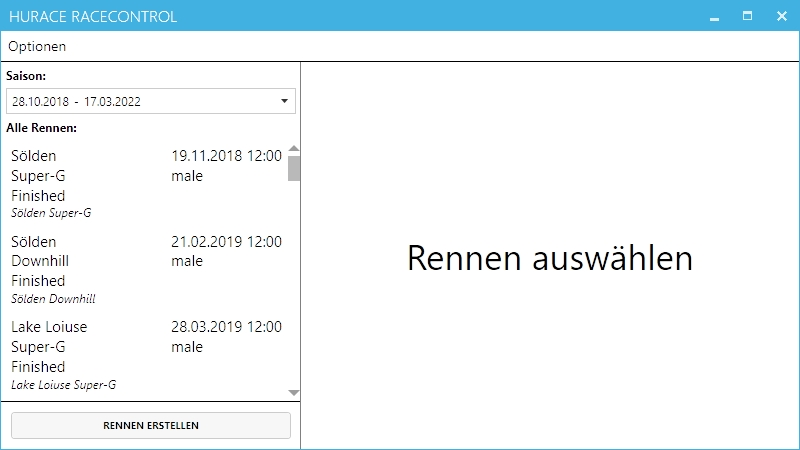

Auf der Hauptseite kann oben links die Saison ausgewählt werden. Anschließend werden alle Rennen der jeweiligen Saison in der Liste darunter angezeigt.

Wird ein neues Rennen erstellt mittels des Buttons im linken unteren Bildschirmbereich wird dieses in der ausgewählten Saison gespeichert.

Um ein Rennen auszuwählen muss auf das gewünschte Rennen aus der Liste geklickt werden, woraufhin die [Rennansicht](#rennansicht) auf der rechten Seite geöffnet wird.

## Rennansicht

Die Rennansicht ermöglicht es Rennen zu bearbeiten bzw. diese zu steuern. Weiters können Rennen mittels eines Buttons rechts oben gelöscht werden, falls diese nicht gestartet wurden und noch keine Startliste erzeugt wurde.
Die Rennansicht teilt sich in folgende vier Seiten:

### Stammdaten

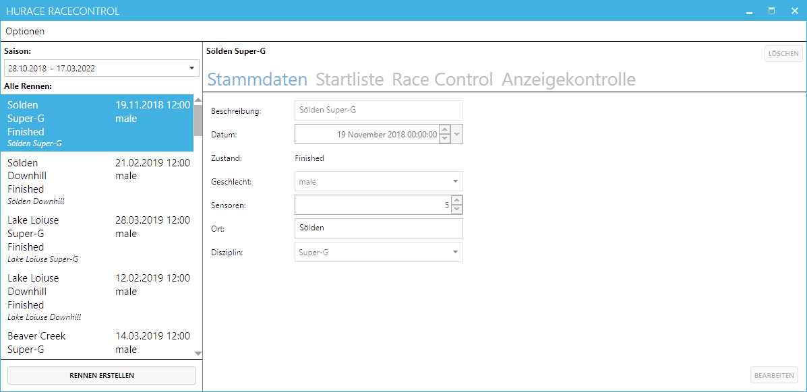

Auf der Stammdatenansicht können die Stammdaten eines Rennens bearbeitet werden. Das Bearbeiten ist jedoch nur möglich, solange ein Rennen noch nicht gestartet wurde.

#### Rennen erstellen / bearbeiten

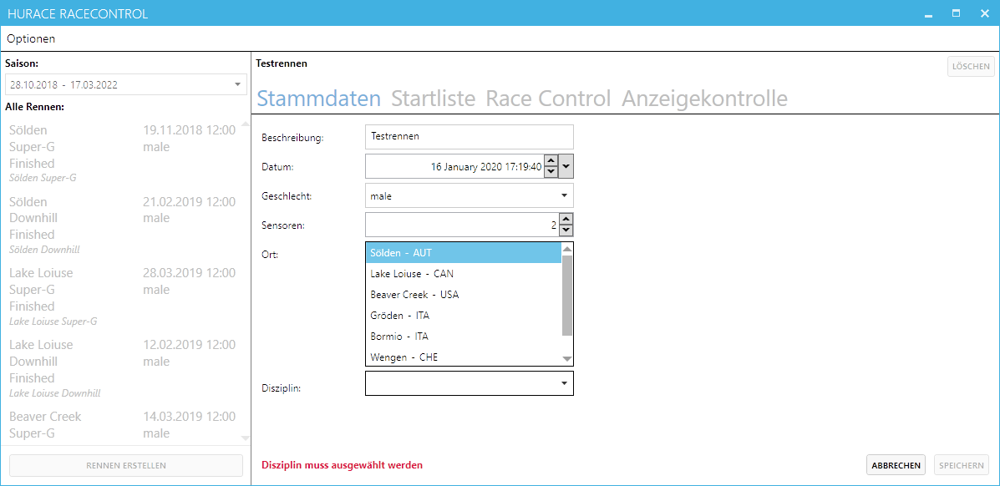

Wir ein neues Rennen erstellt werden alle Fehler im unteren Bereich der Seite angezeigt. Das Speichern wird so lange verhindert so lange nicht alle Fehler behoben wurden.

Weiters ist anzumerken, dass eine Disziplin nur ausgewählt werden wenn ein Ort ausgewählt wurde, dies folgt daraus, dass möglicherweise nicht alle Disziplinen an einem Ort möglich sind.

Wird das Bearbeiten abgebrochen wird unterschieden, ob ein Rennen neu erstellt wurde oder bearbeitet wurde.
Im ersten Fall wird das Rennen und somit alle eingegeben Daten gelöscht. Falls das Rennen nur bearbeitet wurde, wird dies in den originalen Zustand zurückgesetzt womit ebenfalls alle geänderten Daten verloren gehen.

Mittels des Speichern Buttons können die Änderungen gespeichert werden.

### Startliste

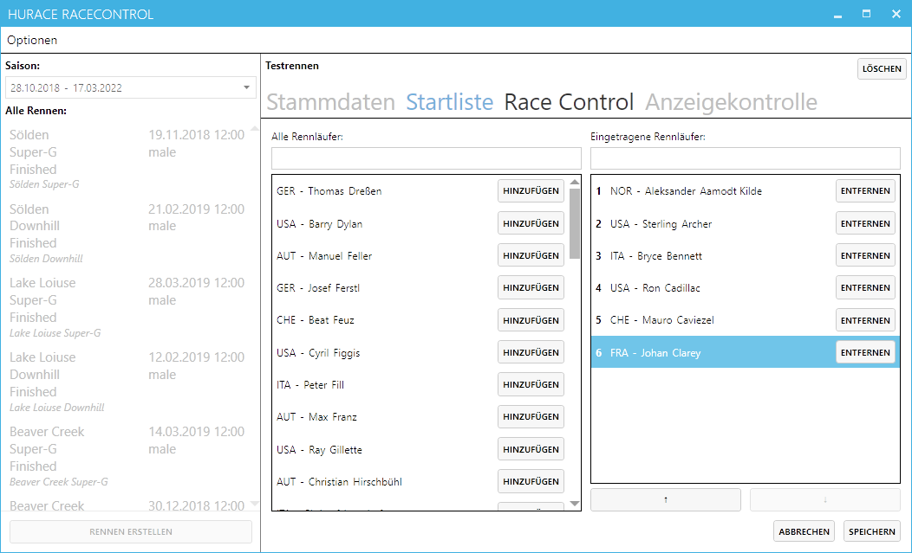

Auf dieser Seite kann die Startliste eines Rennens modifiziert werden. Links befinden sich die Rennfahrer, welche zum Rennen hinzugefügt werden können, rechts jene, welche bereits eingetragen sind.
Mit den beiden Buttons unter der rechten Liste kann der ausgewählte Läufer nach unten oder oben verschoben werden.
Die beiden Felder über der Liste dienen zur Suche, dabei ist zu beachten, dass die Startliste auf der rechten Seite trotzdem nur um einen Platz verschoben werden kann.
Mit den beiden Buttons Speichern und Abbrechen können die Änderungen gespeichert oder verworfen werden.
Die Startliste kann nach starten eines Rennens nicht mehr bearbeitet werden.

### Race Control

Race Control kann 3 Zustände darstellen, je nachdem ob ein Rennen ausständig ist, abgebrochen wurde, fertig ist, oder gerade läuft.

#### Ausständig

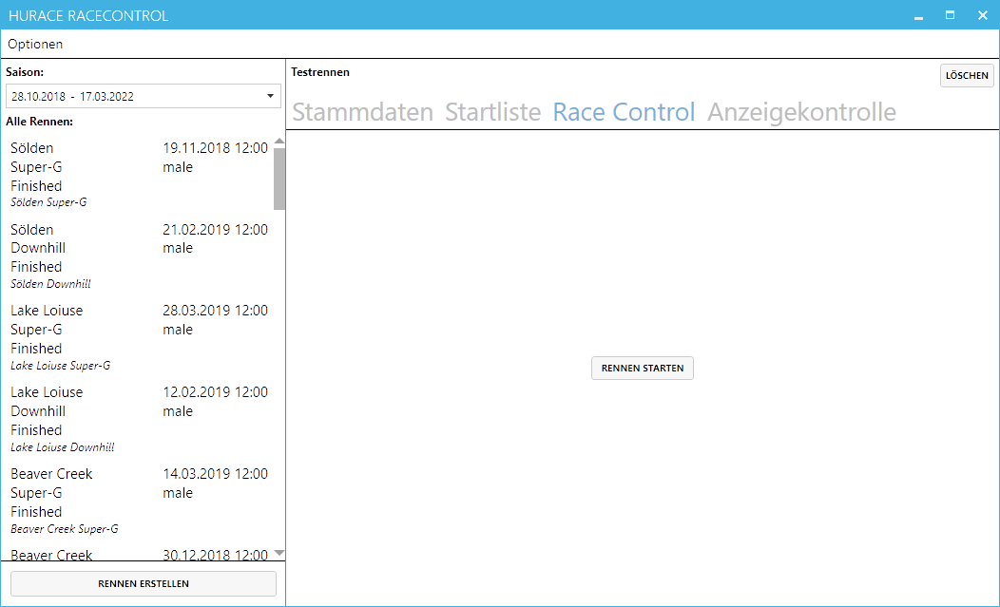

Mittels des Buttons kann das Rennen gestartet werden.
Dies ist nur möglich, wenn das Rennen über eine Startliste verfügt ansonsten ist das Starten nicht möglich.

#### Laufend

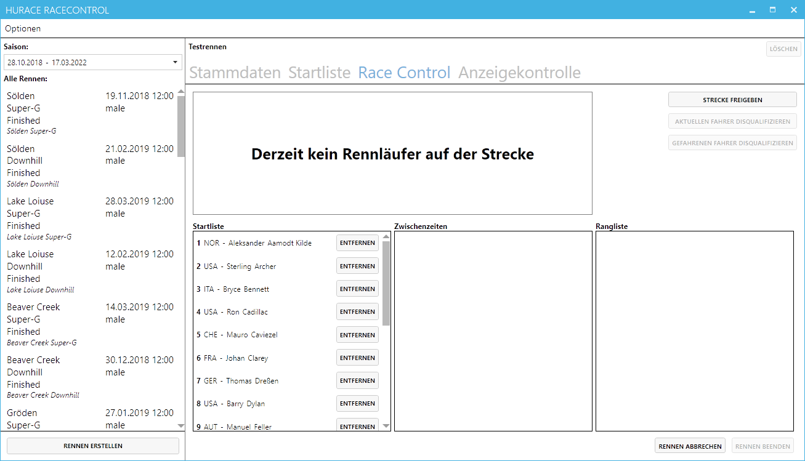

Über die Buttons rechts kann die Strecke freigegeben werden, wodurch auch der jeweilige Skifahrer angezeigt wird. Dieser kann mit dem zweiten Button rechts wieder disqualifiziert werden.
In der Liste links unten können Skier aus der Startreihenfolge entfernt werden, falls diese nicht antreten.
In der Rangliste auf der rechten Seite werden alle Rennläufer im Ziel angezeigt. Disqualifizierte Fahrer werden am Ende der Liste angezeigt. Gefahrene Läufer können mit dem Button auf der rechten oberen Seite nachträglich disqualifiziert werden.

Ein Rennen kann jederzeit abgebrochen werden, jedoch nur beendet werden wenn kein Läufer mehr auf der Strecke ist und sich kein Läufer mehr in der Startliste befindet.

##### Läufer freigegeben

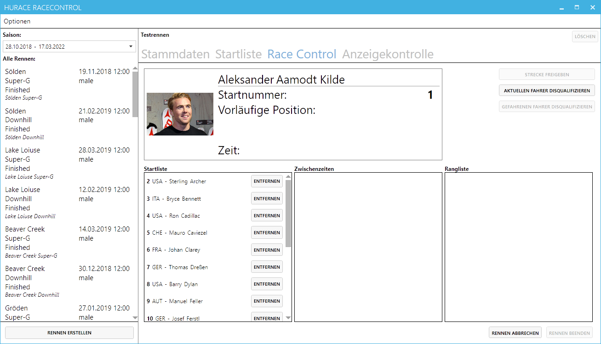

##### Fahrender Läufer

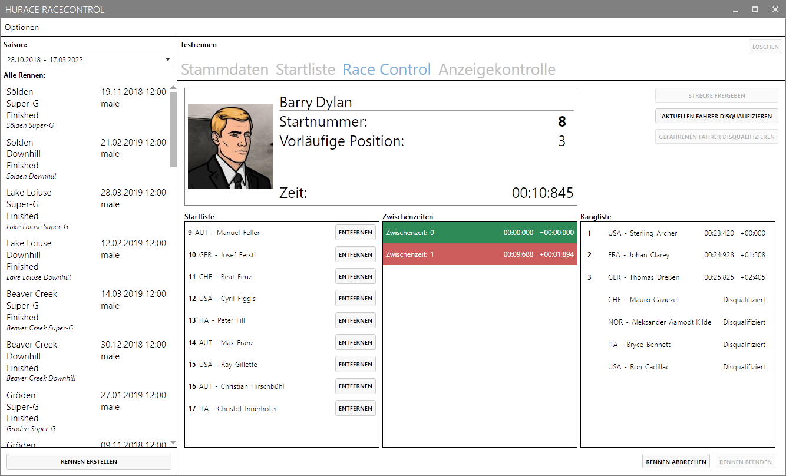

Während der Fahrt wird nach jeder Zwischenzeit die mögliche Position aktualisiert.
Zudem wird mittels der Uhr die aktuelle Laufzeit angezeigt.

##### Läufer im Ziel

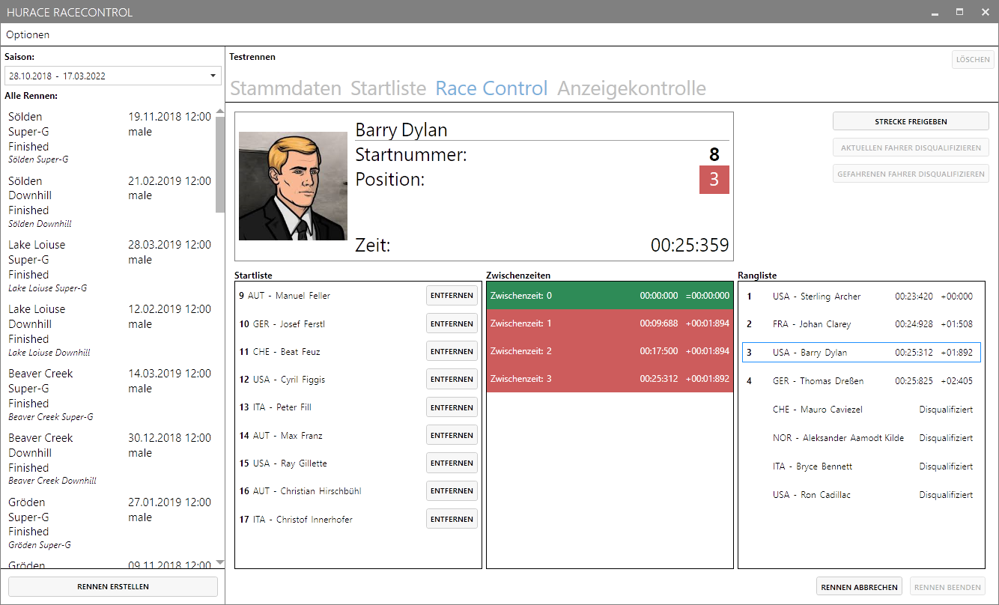

Ist der Läufer im Ziel wird seine Zeit angehalten und seine finale Position angezeigt.
Weiters wird seine Position in der Rangliste hervorgehoben.

#### Abgebrochen

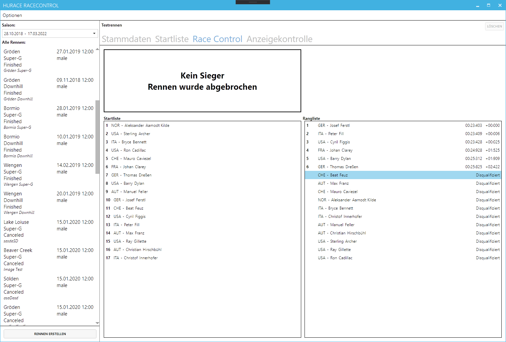

#### Fertig

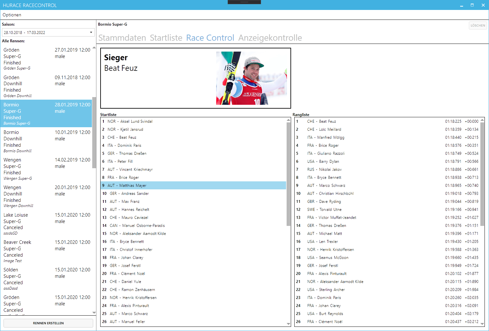

### Anzeigekontrolle

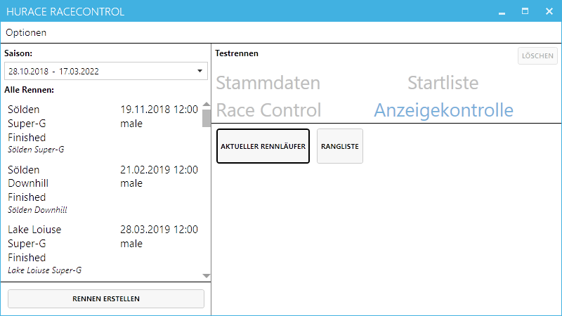

Mittels der Anzeigekontrolle können verschiedene Anzeigen gestartet werden, welche Live Daten darstellen.
Derzeit stehen folgende zwei zur Verfügung.

#### Aktueller Rennfahrer

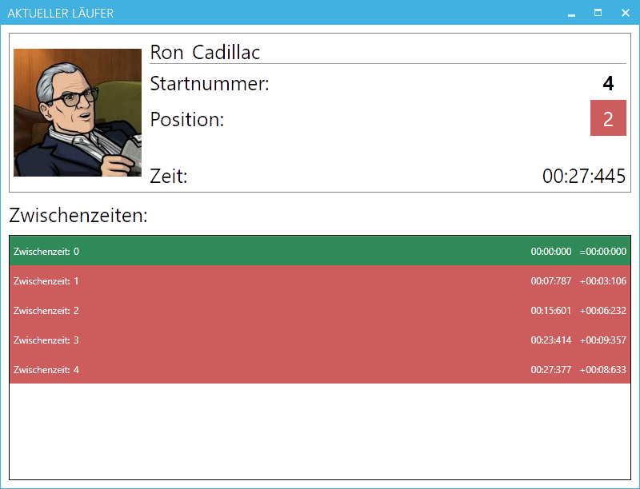

#### Rangliste

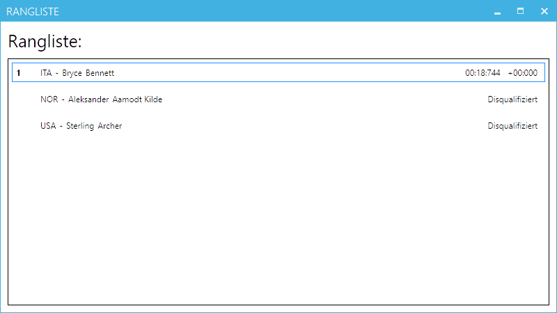
