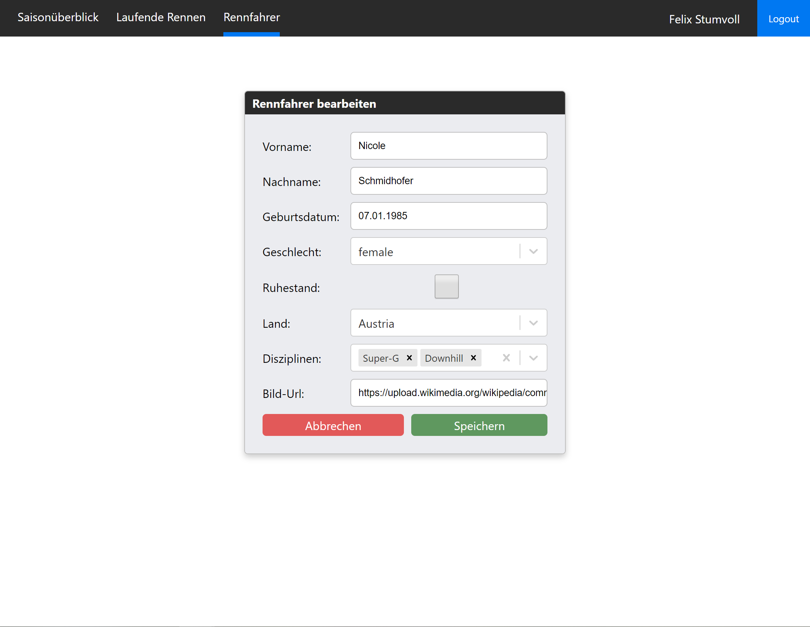

# Hurace Web

## Implementierungsumfang und Aufwand

Aufwand: ca 50 Stunden

absichtlich nicht implementierte Features: 
- Optionale Rennanalyse

## Installationsanleitung

Für die Installation müssen `Node` bzw. `npm` installiert sein.
Zuerst müssen alle Pakete mittels `npm i` geladen werden, dieser Befehl ist im Root Verzeichnis der React Anwendung auszuführen. 
Anschließend kann die Anwendung mittels `npm start` gestartet werden, bzw mittels `npm build` für den Produktionsbetrieb gebuilted werden.
Für eine optimale Benutzerexperience sollte auch die Hurace Rest API gestartet werden. Die Anleitung dazu befindet sich in der Haupt-Dokumentation von Hurace.

## Technologien 

Die Anwendung wurde in React umgesetzt, bei der Implementierungssprache handelt es sich jedoch um Typescript. Weiters werden in dieser Anwendung ausschließlich ``React Hooks`` verwendet, auf Class Components wird komplett verzichtet. Das Template wurde mittels `create-react-app` erstellt. Zusätzlich werden folgende Libraries verwendet (``@types`` sind hier nicht extra angeführt):
- `auth0-spa-js` - Anbindung an den Auth0 OAuth Service
- `react-fontawesome` - Icon Library
- `axios` - Http Client
- `formik` - Library für Formulare
- `react-async-hook` - Hook für Asynchrone Methodenaufrufe
- `react-datepicker` - Datumsauswahl für React
- `react-router-dom` - Routing Library für React
- `react-select` - Combobox für React
- `react-spinners` - Ladeanimationen für React
- `styled-components` - CSS-in-JS Styling Framework (keine Component Library)

Auf die Verwendung einer Component Library wurde komplett verzichtet. Alle Seiten wurden selbst designt und implementiert.

## Architekturüberblick

Die Anwendung kann Grundsätzlich in drei Bereiche gegliedert werden.
- Web-Anwendung
- Hurace Rest API
- Auth0 OAuth2 Service

### Web Anwendung

### Data Fetching

Daten werden nicht im Applicationstate mit z.B. Redux gespeichert, sondern neu geladen sobald eine Seite aufgerufen wird. Dies folgt der Überlegung, dass keine Synchronisation stattfinden muss sondern immer die aktuellen Daten zur Verfügung stehen. Der Zugriff auf die API wird vom Rest der Anwendung abstrahiert. Dies erfolgt in der Datei `api.ts`, diese exportiert alle benötigten Zugriffsmethoden auf die API. Benötigt eine Komponente Daten so werden diese entweder mittels `react-hook-async` oder `useEffect` geladen. Sobald die Daten geladen wurden, wird die Komponente neu gerendert.

### Authentifizierung

Benutzer werden mittels eines OAuth2 Services authentifiziert. Dafür muss der Login Button in der Navbar verwendet werden. Anschließend öffnet sich ein Login Popup. Nach erfolgreichem anmelden wird der Benutzer in der Anwendung als Objekt zur Verfügung gestellt. Dies passiert mittels der `React Context API`.

## Seiten der Anwendung

In diesem Abschnitt werden alle Seiten der Anwendung erklärt und mit Screenshots dargestellt 

### Saisonübersicht

In der Saisonübersicht werden alle Saisonen sortiert aufgelistet und durch anklicken können die Details der jeweiligen Saison angesehen werden ([Saisondetails](#saisondetails)). Ist ein Benutzer angemeldet, kann er mit dem rechten oberen Button eine neu Saison erstellen (beschrieben in [Saison modifizieren](#saison-modifizieren)). Weiters kann nach Saisonen gesucht werden, die Suche beschränkt sich dabei auf das Startdatum bzw. das Enddatum.

#### Saisondetails

In den Saisondetails werden alle Rennen der ausgewählten Saisons sowie das Start und Enddatum der Saison angezeigt. Die Rennen werden nach den Disziplinen gruppiert und nach Datum sortiert. Mittels des bearbeiten Buttons können Saisonen bearbeitet werden (beschrieben in [Saison bearbeiten](#saison-modifizieren)).
Durch den Löschen Button kann eine Saison gelöscht werden. Daraufhin wird folgendes Modal geöffnet. Dies ist jedoch nur möglich, wenn dies keine Rennen enthält.

Durch das Klicken auf ein Rennen wird die Rennansicht geöffnet diese wird im folgenden beschrieben 

##### Rennansicht

In der Rennansicht werden rechts die Sieger des jeweiligen Rennens angezeigt. Mit einem Klick auf den jeweiligen Fahrer kann auf die Detailansicht des jeweiligen Rennens navigiert werden (beschrieben in [Rennfahrerdetails](#rennfahrerdetails)).

Weiters werden die Startliste links unten, sowie die Rangliste rechts unten angezeigt, jeweils mit der Laufzeit sowie Abstand zum Sieger.

#### Saison modifizieren

In dieser Ansicht können Saisonen bearbeitet und erstellt werden. Auf diese Seite navigiert man mittels der Buttons auf den Seiten [Saisonübersicht](#saison%c3%bcbersicht) und [Saisondetails](#saisondetails). Wird eine Saison bearbeitet, werden die Daten geladen und in die Formularfelder eingefügt. Das Formular wird automatisch validiert wie im nächsten Bild zu sehen ist.

Nach erfolgreichem Speichern wird automatisch auf die Detailansicht der Saison navigiert.

### Aktuelle Rennen

In dieser Ansicht werden alle laufenden Rennen aufgelistet. Mit einem Klick auf das Rennen kann die Detailansicht geöffnet werden. Falls zwei oder mehr Rennen gleichzeitig stattfinden werden diese nach der Startzeit sortiert.

#### Aktuelles Rennen Detailansicht

In dieser Ansicht sind einerseits die Stammdaten eines Rennens angezeigt werden. Weiters wird links die verbleibende Startliste angezeigt.

Ist ein Rennläufer auf der Strecke wird er rechts angezeigt, wobei darunter seine Zwischenzeiten zu sehen sind.

Die Daten werden im Abstand von 15 Sekunden vom Server abgefragt.

### Rennfahrerliste

In der Renfahrerliste werden alle Rennläufer angezeigt. Diese sind anhand des Nachnamens sortiert. Mittels der Suche können Schifahrer gefiltert werden. Die Suche bezieht sich auf den Namen als auch auf das Herkunftsland, es können also z.B. alle Rennläufer aus Schweden herausgefiltert werden. Mittels eines Klicks auf den Rennläufer, kann man dessen Detailansicht abrufen. Mittels des Erstellen Buttons kann ein Rennfahrer erstellt werden (beschrieben in [Rennfahrer modifizieren](#rennfahrer-modifizieren))

#### Rennfahrerdetails

In der Detailansicht werden alle Details des Skifahrers aufgelistet. 
Mittels des Bearbeiten Buttons kann der Rennfahrer bearbeitet werden (beschrieben in [Rennfahrer modifizieren](#rennfahrer-modifizieren))

#### Rennfahrer modifizieren

In dieser Ansicht können Rennfahrer bearbeitet bzw. erstellt werden, je nachdem welche Aktion ausgeführt wurde. Gleich wie bei der Saison, werden die Daten geladen und anschließend das Formular befüllt falls ein Rennläufer bearbeitet wird. Dieses Formular wird ebenfalls validiert.

<!-- Der Hurace Web Client besteht aus den folgenden drei Hauptseiten mit den jeweiligen Subseiten:
- `Saisonliste` - Liste alle Saisonen
  - `Saisondetailansicht` - Überblick über alle Rennen einer Saison gruppiert nach Disziplinen
    - `Rendetailansicht` - Überblick über ein Rennen
- `Laufende Rennen` - Liste aller aktuell laufenden Rennen
  - `Laufendes Rennen Detailansicht` - Details zum aktuellen Rennen mit Live Update
- `Rennfahrerliste` - Liste aller Rennfahrer
  - `Rennfahrer Detailansicht` - Details zu einem Rennfahrer -->